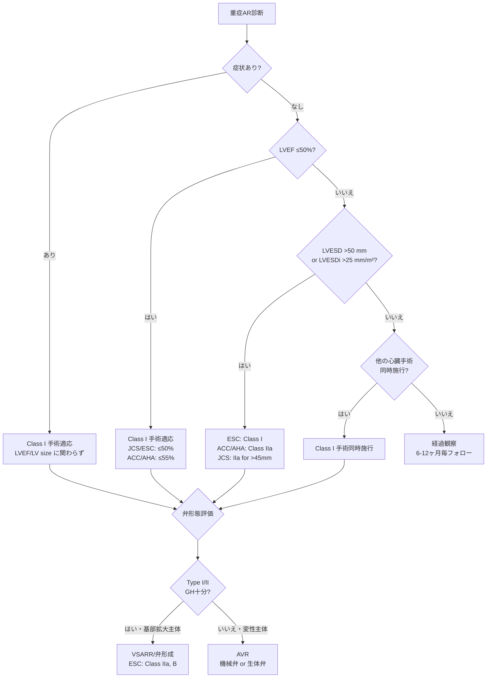

# 大動脈弁閉鎖不全症（AR）に対する大動脈弁手術の適応：各地域ガイドライン比較

**作成日：** 2026年5月15日  
**対象ガイドライン：**
- 🇯🇵 **JCS 2020**：JCS/JSCS/JATS/JSVS 2020年改訂版 弁膜症治療ガイドライン（日本）
- 🇪🇺 **ESC/EACTS 2025**：ESC/EACTS 2025 Guidelines on the Management of Valvular Heart Disease（欧州）
- 🇺🇸 **ACC/AHA 2020**：ACC/AHA 2020 Guideline for the Management of Patients With Valvular Heart Disease（米国）

**関連ドキュメント：** [[AS_AVR_Guidelines_Comparison|AS/AVR/TAVIガイドライン比較]] · [[MS_MV_Surgery_Guidelines_Comparison|僧帽弁狭窄症ガイドライン比較]] · [[AF_Surgery_Indications_Guideline_Comparison|AF手術適応比較]] · [[Ascending_Aorta_Surgery_Indications_Guideline_Comparison|上行大動脈手術適応比較]] · [[Combined_VHD_Guidelines_Comparison|複合弁膜症ガイドライン比較]] · [[Ross_Procedure_Guidelines_Comparison|Ross手術まとめ]] · [[Perioperative_Anticoagulation_Guidelines_Comparison|術前抗凝固管理比較]]

---

## 目次

1. [大動脈弁閉鎖不全症の分類と病因](#1-大動脈弁閉鎖不全症の分類と病因)
2. [重症度分類](#2-重症度分類)
3. [症候性ARに対する手術適応](#3-症候性arに対する手術適応)
4. [無症候性ARに対する手術適応](#4-無症候性arに対する手術適応)
5. [急性ARへの対応](#5-急性arへの対応)
6. [術式の選択：AVR・弁形成・弁温存基部置換（VSARR）](#6-術式の選択avr弁形成弁温存基部置換vsarr)
7. [TAVI for AR の位置付け](#7-tavi-for-ar-の位置付け)
8. [各地域の相違点 比較表](#8-各地域の相違点-比較表)
9. [まとめ・総括](#9-まとめ総括)

---

## 1. 大動脈弁閉鎖不全症の分類と病因

### 1-1. 病因による分類（弁性病変 vs 基部拡大）

| 機序 | 病因 | 代表的疾患 |
|------|------|-----------|
| **弁性 — 先天性** | 二尖弁・一尖弁・四尖弁 | BAV（特に若年AR） |
| **弁性 — 後天性** | 加齢変性、感染性心内膜炎（IE）、リウマチ性、弁尖逸脱、VSDに伴う弁嵌入、放射線、薬剤性（カルチノイド等）、外傷 | 高齢者の変性AR、IE |
| **基部拡大 — 先天性/遺伝性** | 結合織疾患（Marfan, Loeys-Dietz, Ehlers-Danlos）、骨形成不全症 | Marfan-related AR |
| **基部拡大 — 後天性** | 大動脈弁輪部拡張症（annuloaortic ectasia）、高血圧、自己免疫疾患（SLE、強直性脊椎炎）、大動脈炎（梅毒性、高安）、大動脈解離、外傷 | 加齢/高血圧による基部拡大 |

> [!info] BAVは欧米で最多のAR原因の一つだが、東洋人ではVSDに伴うAR（漏斗部VSDによる右冠尖逸脱）も重要な原因として認識される（JCS 2020で言及）。

### 1-2. AR機能分類（Carpentier型分類の応用）

ESC/EACTS、JCS、ACC/AHAいずれもCarpentier様の機能分類を採用し、弁形成術や弁温存基部置換の術式選択の指針としている。

| Type | 弁尖の動き | 基本病態 | 主な術式選択 |
|------|-----------|---------|------------|
| **Type Ia** | 正常 | ST junction〜上行大動脈拡大 | 上行大動脈置換（弁温存可） |
| **Type Ib** | 正常 | バルサルバ洞〜ST junction拡大 | リモデリング/リインプランテーション（VSARR） |
| **Type Ic** | 正常 | 弁輪拡大 | 弁輪縫縮 + 必要に応じVSARR |
| **Type Id** | 正常 | 弁尖穿孔（IE等） | パッチ閉鎖 |
| **Type II** | 弁尖逸脱 | 逸脱（cusp prolapse） | 弁尖縫縮・三角切除（valve repair） |
| **Type III** | 弁尖の運動制限 | 弁尖石灰化・短縮（変性・リウマチ） | 弁置換（AVR）が主体 |

> [!note] 弁形成術（valve repair）が適応となるのは主にType I/II。Geometric height（GH）が十分であることが弁形成術の成否を決める重要な術前指標である（JCS 2020は「GHが不足する症例は弁形成に不適」と定性的に記載。GH ≥16 mmは外科領域で広く用いられる目安値であり、ガイドライン本文が明記した数値閾値ではない）。

---

## 2. 重症度分類

### 2-1. TTEを中心とした重症度判定（3ガイドライン共通の主要パラメータ）

| 評価項目 | 軽症 | 中等症 | 重症 |
|---------|------|-------|------|
| **縮流部幅（VC）** | <0.3 cm | 0.3–0.6 cm | **>0.6 cm** |
| **ジェット幅 / LVOT径（%）** | <25 | 25–64 | **≥65** |
| **逆流量 RVol（mL/beat）** | <30 | 30–59 | **≥60** |
| **逆流率 RF（%）** | <30 | 30–49 | **≥50** |
| **EROA（cm²）** | <0.10 | 0.10–0.29 | **≥0.30** |
| **PHT（ms）** | >500 | 200–500 | **<200** |
| **下行大動脈拡張期逆行波** | わずか | 中間 | **明らかな全拡張期逆行** |

> [!note] 重症度判定は単一パラメータではなく、定性・半定量・定量評価を組み合わせて総合判定する（3ガイドライン共通）。

### 2-2. ACC/AHA 独自のステージ分類（A〜D）

ACC/AHAは慢性ARに対してAS同様のA〜Dステージ分類を採用している。

| ステージ | 定義 | 症状 | 重症度 | LVEF/LV所見 |
|---------|------|------|-------|------------|
| **A** | ARリスク状態 | なし | なし/trace | 正常 |
| **B** | 進行性AR | なし | 軽症〜中等症 | 正常 |
| **C1** | 無症候性重症AR（正常EF） | なし | 重症（VC>0.6 cm, RF≥50%, EROA≥0.30 cm², RVol≥60 mL） | LVEF >55%、軽度〜中等度LV拡大 |
| **C2** | 無症候性重症AR（EF低下/重度LV拡大） | なし | 重症 | LVEF ≤55% or LVESD >50 mm（または LVESDi >25 mm/m²） |
| **D** | 症候性重症AR | あり（労作時呼吸困難・狭心症等） | 重症 | LVEFは様々 |

> [!info] JCS・ESC/EACTSはこのアルファベットステージ分類を採用せず、症状・LVEF・LVESDを個別の手術適応基準として運用する。

---

## 3. 症候性ARに対する手術適応

### 3-1. 症候性重症AR（NYHA II〜IV、労作時呼吸困難・狭心症等）

| 推奨事項 | JCS 2020 | ESC/EACTS 2025 | ACC/AHA 2020 |
|---------|---------|---------------|-------------|
| **症候性重症ARに対する大動脈弁手術** | **Class I, Level B** | **Class I, Level B** | **Class I, Level B-NR**（Stage D） |
| **LVEF低下の有無に関わらず手術適応** | ◯（術前投薬で最適化後に施行） | ◯（LV機能に関わらず） | ◯（LV systolic functionに関わらず） |

> [!success] 3ガイドライン共通
> 症候性重症ARはLVEFや左室サイズに関わらず**Class I**で手術適応となる。術前にLV機能低下があっても、最適化薬物療法の上で速やかに手術を施行することが推奨される。

---

## 4. 無症候性ARに対する手術適応

### 4-1. LVEF低下例（最も強い適応）

| 介入トリガー | JCS 2020 | ESC/EACTS 2025 | ACC/AHA 2020 |
|------------|---------|---------------|-------------|
| **LVEF ≤50%（JCS, ESC基準）/ ≤55%（ACC/AHA基準）** | **Class I, Level B**（<50%） | **Class I, Level B**（≤50%） | **Class I, Level B-NR**（≤55%）（Stage C2） |

> [!warning] 差異ポイント①：LVEF介入閾値
> ACC/AHA 2020は無症候性ARに対し ==**LVEF ≤55%**== を Class I 適応閾値として採用するが、JCS 2020およびESC/EACTS 2025は ==**LVEF ≤50%**== を採用する。ACC/AHAは2020改訂時に従来の<50%から<55%へ早期介入方向に閾値を引き上げた。

### 4-2. LV拡大例（LVEF保存）

| 介入トリガー | JCS 2020 | ESC/EACTS 2025 | ACC/AHA 2020 |
|------------|---------|---------------|-------------|
| **LVESD >50 mm（絶対値）** | 記載なし（>45 mmを採用） | **Class I, Level B** | **Class IIa, Level B-NR**（Stage C2） |
| **LVESD >45 mm（日本人体格を考慮）** | **Class IIa, Level B** | 記載なし（>50 mm採用） | 記載なし |
| **LVESDi >25 mm/m²（BSA補正）** | **Class IIb, Level C**（フォロー強化条件付き） | **Class I, Level B**（特にBSA<1.68 m²） | **Class IIa, Level B-NR**（Stage C2） |
| **LVESDi >22 mm/m²** | 記載なし | **Class IIb, Level B**（特にBSA<1.68 m²） | 記載なし |
| **LVESVi >45 mL/m²（収縮末期容積指数）** | 記載なし | **Class IIb, Level B** | 記載なし |
| **LVEDD >65 mm** | **Class IIb, Level C** | 推奨表外に本文記載あり（LVEDD >65 mm＋進行性LV拡大/EF低下を本文で言及） | 記載なし（LVEDDの記載あるが3次的指標） |
| **安静時 LVEF ≤55%（軽度低下）** | 記載なし | **Class IIb, Level B**（低リスク手術前提） | **Class I, Level B-NR**（即手術適応） |
| **LVEF 55-60%への進行性低下 + LV severe dilation（LVEDD >65 mm）** | 記載なし | 記載なし | **Class IIb, Level B-NR** |

> [!warning] 差異ポイント②：LVESDの絶対値 vs 体格補正
> - 🇯🇵 **JCS 2020** は日本人の小柄な体格を考慮し、絶対値 ==**LVESD >45 mm**== を Class IIa 適応として採用し、LVESDi >25 mm/m² は「フォロー強化警告基準」として Class IIb 扱い
> - 🇪🇺 **ESC/EACTS 2025** は ==**LVESD >50 mm** または **LVESDi >25 mm/m²**== を Class I 適応とし（特にBSA<1.68 m²でindex重視）、LVESDi >22 mm/m² や LVESVi >45 mL/m² も Class IIb として明示
> - 🇺🇸 **ACC/AHA 2020** は LVESD >50 mm または LVESDi >25 mm/m² を ==**Class IIa**== として運用し、LVESD単独でClass I適応にはしない

### 4-3. その他併存条件（重症AR + 他の心臓手術）

| 推奨事項 | JCS 2020 | ESC/EACTS 2025 | ACC/AHA 2020 |
|---------|---------|---------------|-------------|
| **重症AR + 上行大動脈手術・CABG・MV手術を同時施行する場合のAVR** | **Class I, Level C** | **Class I, Level C** | **Class I, Level C-EO**（Stage C/D） |
| **中等症AR + 他の心臓手術を同時施行する場合のAVR** | **Class IIa, Level C** | 記載あり（Heart Team判断） | **Class IIa, Level C-EO**（Stage B） |

---

## 5. 急性ARへの対応

| 病態 | 治療方針（3ガイドライン共通的見解） |
|------|----------------------------------|
| **急性重症AR（IE、大動脈解離、外傷由来等）** | 緊急手術が原則。血行動態破綻（肺水腫・心原性ショック）を呈するため、診断確定と同時に外科介入を検討 |
| **薬物的橋渡し** | 血管拡張薬（ニトロプルシド等）・利尿薬で前負荷軽減。**β遮断薬は徐脈化により悪化させるため原則禁忌**（ただしStanford A型大動脈解離合併例ではA型解離治療の一環として血圧コントロール目的で慎重使用） |
| **大動脈解離合併の急性AR** | Stanford A型解離 + AR は緊急上行大動脈置換 ± 弁温存基部置換 or AVR の適応 |
| **IEによる急性AR** | IE合併AR（心不全、菌制御不能、塞栓リスク）はClass I適応（[[Combined_VHD_Guidelines_Comparison]]参照） |

> [!warning] β遮断薬の使用注意
> ACC/AHA 2020は急性AR患者へのβ遮断薬使用について「**他の急性AR原因では非常に慎重に使用するか、避けるべき**」と明記。代償性頻脈をブロックし血圧の著明な低下を招くため。

---

## 6. 術式の選択：AVR・弁形成・弁温存基部置換（VSARR）

### 6-1. 術式選択の基本指針（3ガイドライン共通）

| 術式 | 適応 | 利点 | 注意点 |
|------|------|------|-------|
| **大動脈弁置換術（AVR）：機械弁** | 若年（おおむね<60歳）、長期耐久性重視、抗凝固管理可能例 | 長期耐久性 | 生涯ワルファリン療法（[[Mechanical_Valve_Anticoagulation_INR_Targets]]参照） |
| **大動脈弁置換術（AVR）：生体弁** | 高齢、抗凝固禁忌例、女性で妊娠希望例 | 抗凝固不要（リスク許容内） | 構造的弁劣化（SVD）による再手術リスク |
| **弁形成術（Aortic Valve Repair）** | Type II（弁尖逸脱）/ 一部Type I、GH十分（≥16 mmは一般的な外科的目安） | 抗凝固不要、native valve保存 | 経験豊富施設に限定、長期耐久性データ蓄積中 |
| **弁温存基部置換（VSARR：Yacoub/David）** | Type Ia/Ib（基部拡大主体、弁尖変性なし）、Marfan等の若年基部拡大例 | native valve保存、抗凝固不要 | 高度な術者技量必要 |
| **Bentall手術（複合弁付グラフト）** | 弁尖変性 + 基部拡大、高齢、structural valve degeneration | 確立術式、長期成績良好 | 弁＋人工血管同時置換、抗凝固管理（機械弁の場合） |

### 6-2. 弁形成・VSARRに関するガイドライン推奨

| 推奨事項 | JCS 2020 | ESC/EACTS 2025 | ACC/AHA 2020 |
|---------|---------|---------------|-------------|
| **重症AR + 適切な弁形態の症例に対する経験豊富施設での弁形成術** | 推奨（記載あり） | **Class IIa, Level B** | 推奨（記載あり、Class明示なし） |
| **弁温存基部置換（VSARR）：Marfan等若年基部拡大例** | 記載あり（外科治療項） | **明示的推奨**（2025改訂で強調） | 記載あり |
| **3D TEE / 心臓CTによる術前計測（GH, EH, 弁輪径, バルサルバ径, ST junction径）** | **Class IIa**（CT） | 推奨（記載あり） | 推奨（記載あり） |

> [!info] ESC/EACTS 2025の弁形成術推奨（Class IIa, B）
> "AV repair should be considered in selected patients with severe AR at experienced centres, when durable results are expected."
> — 経験豊富施設で耐久性が期待できる症例を選択した上でClass IIa適応。

---

## 7. TAVI for AR の位置付け

### 7-1. 単独AR症例に対するTAVIの推奨

| 推奨事項 | JCS 2020 | ESC/EACTS 2025 | ACC/AHA 2020 |
|---------|---------|---------------|-------------|
| **手術適応のある単独重症ARへのTAVI** | 推奨なし（適応外的位置付け） | 高リスク例での選択肢として言及 | **Class III: Harm, Level B-NR**（SAVR適応かつ手術候補ならTAVI禁止） |
| **手術禁忌・超高リスクのAR + HF症例へのTAVI** | 限定的（症例選択） | **慎重な症例選択下で考慮可** | 極めて限定的（弁輪サイズ・石灰化が適切な場合のみ） |

> [!warning] 差異ポイント③：TAVI for AR
> 単独ARに対するTAVIは、**SAVR適応かつ手術候補となる症例ではACC/AHA 2020が明確にClass III（Harm）として禁忌**としている。一方、**手術禁忌・超高リスク + 弁輪/石灰化条件が適合する症例**については3ガイドラインとも極めて限定的に許容する立場である。

### 7-2. TAVI for AR が技術的に困難な理由（3ガイドライン共通の見解）

1. **大動脈弁輪・基部の拡大**：standard TAVR弁のアンカリングが困難
2. **弁尖石灰化の不足**：ASとは異なり弁尖の石灰化が乏しく、留置弁の固定が不十分
3. **valve migration（弁逸脱）のリスク**：留置後の弁脱落・移動
4. **重大な弁周囲漏出（paravalvular leak, PVL）**：高頻度に発生
5. **専用 AR 用 TAVR デバイス**（J-Valve、JenaValveなど）の使用は欧米で限定的、本邦未承認

---

## 8. 各地域の相違点 比較表

### 8-1. 主要な相違点サマリー

| 相違ポイント | JCS 2020（日本） | ESC/EACTS 2025（欧州） | ACC/AHA 2020（米国） |
|------------|----------------|----------------------|---------------------|
| **無症候性ARのLVEF介入閾値（Class I）** | **≤50%** | **≤50%** | **≤55%**（早期介入志向） |
| **LV拡大による介入閾値（LVESD絶対値）** | **>45 mm（IIa）**（日本人体格考慮） | **>50 mm（I）** | **>50 mm（IIa）** |
| **LVESDi（BSA補正）のクラス** | >25 mm/m² → **IIb**（警告基準） | >25 mm/m² → **I**（特にBSA<1.68 m²） | >25 mm/m² → **IIa** |
| **LVESDi >22 mm/m² や LVESVi >45 mL/m² の明示** | 記載なし | **Class IIb, B**（明示） | 記載なし |
| **LVEDD >65 mm の取り扱い** | **IIb, C** | 推奨表外に本文記載あり | LVEDD言及あるが3次的（IIb） |
| **ステージ分類方式** | 重症度別（軽/中/重症） | 重症度別 | **A〜Dアルファベットステージ分類** |
| **弁形成術の推奨クラス** | 推奨（明示クラス記載なし） | **Class IIa, B**（明示） | 推奨（明示クラス記載なし） |
| **VSARRの強調** | 記載あり | **2025改訂で強調** | 記載あり |
| **TAVI for AR（SAVR適応症例）** | 適応外的位置付け | 高リスク例で考慮 | **Class III: Harm, B-NR** |
| **エビデンスレベル表記** | A/B/C | A/B/C | **B-R/B-NR/C-LD/C-EOと細分化** |
| **AR原因としてのVSD言及** | **明示**（東洋人での重要原因） | 限定的 | 限定的 |

### 8-2. 無症候性AR介入適応の総合比較

| トリガー条件 | JCS 2020 | ESC/EACTS 2025 | ACC/AHA 2020 |
|------------|---------|---------------|-------------|
| **LVEF ≤50%** | **I / B** | **I / B** | I / B-NR（≤55%） |
| **LVEF 50-55%** | 記載なし | **IIb / B** | **I / B-NR** |
| **LVESD >50 mm** | 記載なし | **I / B** | **IIa / B-NR** |
| **LVESD >45 mm** | **IIa / B**（日本基準） | 記載なし | 記載なし |
| **LVESDi >25 mm/m²** | **IIb / C**（警告） | **I / B**（特に小柄） | **IIa / B-NR** |
| **LVESDi >22 mm/m²** | 記載なし | **IIb / B** | 記載なし |
| **LVESVi >45 mL/m²** | 記載なし | **IIb / B** | 記載なし |
| **LVEDD >65 mm** | **IIb / C** | 推奨表外に本文記載あり | IIb / B-NR（LVEF低下傾向と併用） |
| **他の心臓手術同時施行例の重症AR** | **I / C** | **I / C** | **I / C-EO** |
| **他の心臓手術同時施行例の中等症AR** | **IIa / C** | Heart Team判断 | **IIa / C-EO** |

### 8-3. 術式選択の比較

| 患者背景 | JCS 2020 | ESC/EACTS 2025 | ACC/AHA 2020 |
|---------|---------|---------------|-------------|
| **若年（<60歳）+ 弁尖正常・基部拡大主体（Type Ia/Ib）** | VSARR検討 | **VSARR推奨（強調）** | VSARR検討 |
| **Marfan症候群** | 基部置換（VSARR or Bentall） | **VSARR推奨**（弁尖変性ない場合） | VSARR or Bentall |
| **Type II弁尖逸脱（GH十分；≥16 mmは外科的目安）** | 弁形成検討 | **弁形成（Class IIa, B）** | 弁形成検討 |
| **高齢・弁尖変性主体（Type III）** | AVR（多くは生体弁） | AVR（生体弁中心） | AVR（生体弁中心） |
| **手術禁忌・超高リスクのAR** | 内科治療中心 | 限定的TAVI考慮 | 内科治療中心（TAVIは極めて限定的） |

---

## 9. まとめ・総括

### 共通事項

> [!success] 3ガイドライン共通の合意事項
> 1. **症候性重症ARはLVEF・LVサイズに関わらず Class I で手術適応**（エビデンスレベル B/B-NR）
> 2. **無症候性重症AR + LVEF ≤50% は手術 Class I 適応**（ACC/AHAのみ閾値≤55%へ早期化）
> 3. **重症AR + 他の心臓手術同時施行例は Class I で大動脈弁手術同時施行**
> 4. **急性重症ARは緊急手術適応**（β遮断薬は原則禁忌）
> 5. **Type I/II弁形態を有する症例での弁形成・VSARR検討**（経験豊富施設に限定）
> 6. **単独AR症例へのTAVIは原則として推奨されない**（手術禁忌の超高リスク例で例外的に考慮）

### 主要な相違点まとめ

| # | 相違点 | 詳細 |
|---|--------|------|
| **①** | **LVEF介入閾値** | JCS・ESC：≤50% / **ACC/AHA：≤55%**（早期介入志向） |
| **②** | **LVESD絶対値の取り扱い** | JCS：>45 mm が IIa（日本人体格考慮） / ESC：>50 mm が **I** / ACC/AHA：>50 mm が IIa |
| **③** | **LVESDi（BSA補正）の推奨クラス** | JCS：IIb（警告） / ESC：**I**（小柄患者重視） / ACC/AHA：IIa |
| **④** | **LV容積指標（LVESVi）の明示** | ESC/EACTS 2025のみ **Class IIb, B** で明示 |
| **⑤** | **弁形成術の推奨強度** | ESC/EACTS：**Class IIa, B** で明示 / JCS・ACC/AHAは推奨記載のみ |
| **⑥** | **VSARRの強調度** | ESC/EACTS 2025改訂で **最も強調** |
| **⑦** | **TAVI for AR** | ACC/AHA：**Class III: Harm, B-NR**（明確禁忌） / 他は限定的に考慮余地 |
| **⑧** | **ステージ分類** | ACC/AHAのみA〜Dアルファベット分類を採用 |
| **⑨** | **AR原因としてのVSD** | JCSのみ漏斗部VSD合併ARを東洋人に多い原因として明示 |

### 臨床的含意

> [!abstract] 地域別アプローチの特徴
> - 🇪🇺 **欧州（ESC/EACTS 2025）** は LVESDi（BSA補正）を中核として **特に小柄体型患者で早期介入**を強調し、弁形成術・VSARRに **明示的なクラス推奨**（IIa, B）を付与。2025改訂で弁温存術式の重要性をさらに前面に出した。
> - 🇺🇸 **米国（ACC/AHA 2020）** は **無症候性AR の LVEF 介入閾値を ≤55% に引き上げ**た早期介入志向が特徴。一方で LV 拡大による介入は LVESD >50 mm を Class IIa とやや慎重。単独 AR への TAVI を Class III: Harm として明確に禁忌化。
> - 🇯🇵 **日本（JCS 2020）** は **日本人の小柄な体格**を考慮し LVESD 絶対値 >45 mm を Class IIa として採用（欧米の>50 mmより低い閾値）。一方でLVESDi（BSA補正）は警告基準扱い（IIb）と他地域より控えめ。VSDに伴うARなど東洋人特有のAR原因に言及している。

### 臨床判断のフロー（3ガイドライン統合視点）

---

*本文書は各ガイドライン原本の推奨事項を忠実に要約したものです。推奨クラス（I, IIa, IIb, III）およびエビデンスレベルは原文に基づいています。実際の臨床判断は各症例の状況（体格・年齢・併存疾患・弁形態・術者経験）を踏まえ、Heart Teamにて総合的に行うことが推奨されます。*

**参照原本：**
- JCS/JSCS/JATS/JSVS 2020 弁膜症治療ガイドライン 第4章 大動脈弁閉鎖不全症 / 大動脈弁逆流症（AR）
- 2025 ESC/EACTS Guidelines for the management of valvular heart disease, Section 7: Aortic regurgitation
- 2020 ACC/AHA Guideline for the Management of Patients With Valvular Heart Disease, Section 4: Aortic Regurgitation

---

> [!success] ✅ Fact check完了（2026年5月23日）
> 本文書の推奨クラス・エビデンスレベル・数値閾値を、原典ガイドラインPDF（JCS/JSCS/JATS/JSVS 2020、ESC/EACTS 2025、ACC/AHA 2020）と逐語照合して検証済み。
>
> **本検証での修正点：**
> - Geometric height（GH）≥16 mm はガイドライン本文が明記した数値閾値ではなく、一般的な外科的目安である旨を明確化（弁形成術の記載4箇所）
> - ESC/EACTS 2025 の LVEDD >65 mm は「記載なし」ではなく推奨表外の本文に記載がある旨へ修正（比較表3箇所）
>
> 上記以外の推奨クラス・エビデンスレベル・数値閾値は原典と一致することを確認。
