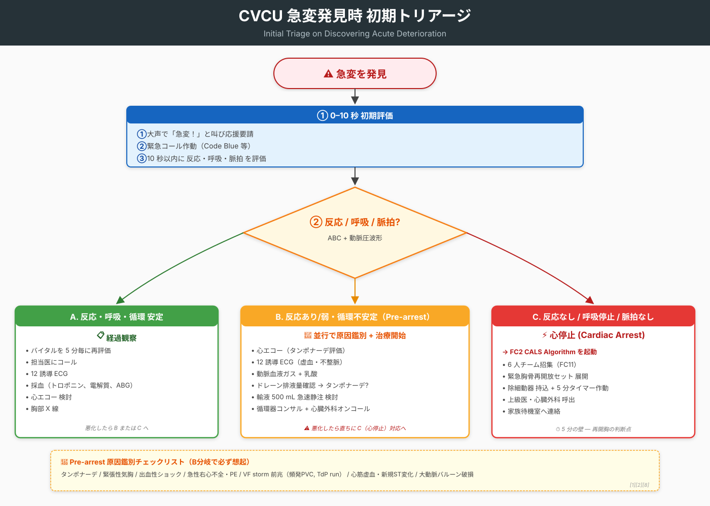
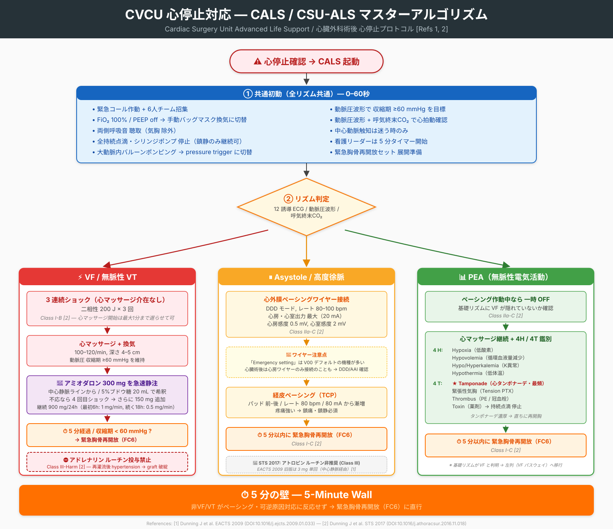
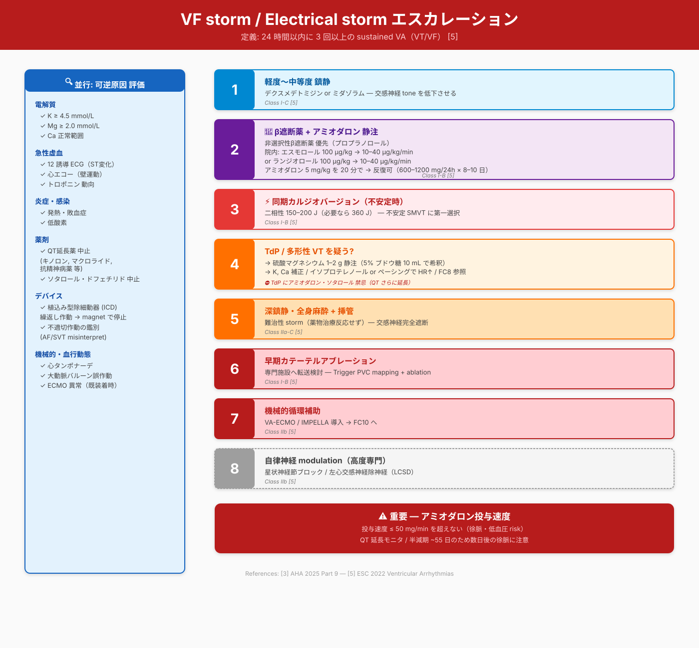
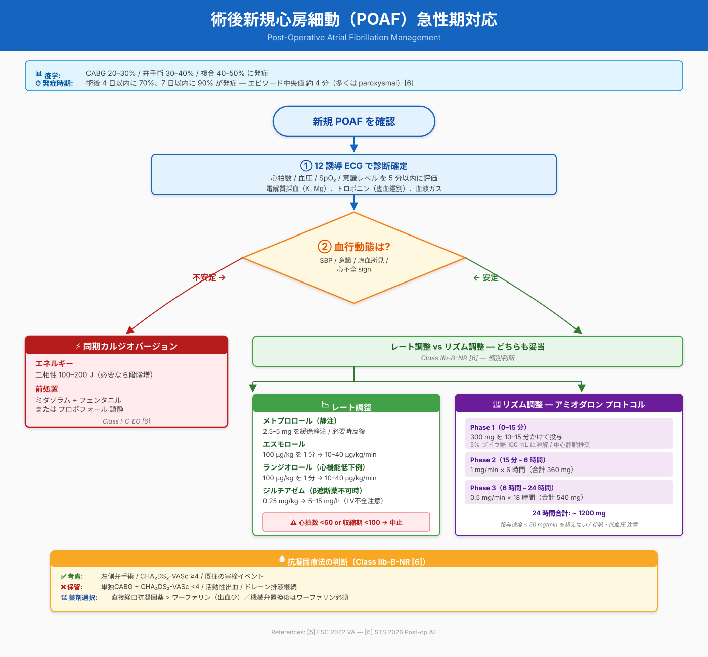
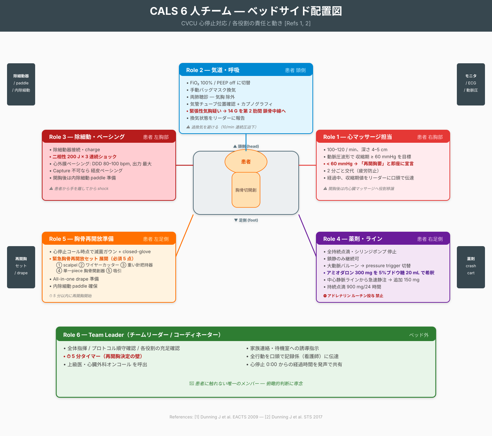

# CVCU 心臓外科術後 急変対応プロトコル

> **Cardiac Vascular Care Unit (CVCU) における心臓手術後患者の急変対応**
> 医師・看護師のための行動規範ガイドライン
>
> **作成日**: 2026-05-19
> **対象患者**: 開心術後（CABG / 弁置換・形成 / 大動脈手術 / 心移植・LVAD 等）の患者で、ICU から CVCU（step-down unit）に移行した患者
> **対象スタッフ**: CVCU 看護師、夜勤当直医、心臓外科レジデント、循環器内科コンサルタント
> **出典**: 8本の査読論文ガイドライン（巻末 References 参照）

---

## ⚠️ 最重要原則 — 通常 ACLS との違い

心臓手術後患者の心停止対応は **通常 ACLS とは異なるプロトコル（CALS / CSU-ALS）** に従う。以下は **CVCU 全スタッフが暗記すべき**:

| 項目 | 通常 ACLS [3] | 心臓術後 CALS [1][2] |
|---|---|---|
| **VF/pVT への初動** | 1回shock → 直ちに CPR 2分 | **3連続shock を先行**（CPR より優先, Class I-B [2]） |
| **アドレナリン 1mg** | 3–5分毎に投与 (Class 1-B [3]) | **ルーチン投与禁止**（Class III-Harm [2]）— senior医師指示下のみ |
| **胸骨再開放** | 適応外 | 5分以内に施行（Class I-C [2]） |
| **心マ深度** | 5–6 cm | 4–5 cm／動脈圧波形で systolic ≥60 mmHg を目標 [1] |
| **アトロピン (asystole)** | ルーチン非推奨 [3] | EACTS 旧版: 3mg [1] → **STS 2017: ルーチン非推奨 (Class III)** [2] |

🚨 **CVCU で心停止 → CALS 通報 → 6人チーム招集 → 5分以内に胸骨再開放準備**

---

## 📋 目次

1. [緊急コール基準と急変フロー全体図](#1-緊急コール基準と急変フロー全体図)
2. [心停止対応 — CALS/CSU-ALS プロトコル](#2-心停止対応--calscsu-als-プロトコル)
3. [緊急胸骨再開放（Emergency Resternotomy）](#3-緊急胸骨再開放emergency-resternotomy)
4. [薬剤投与プロトコル — 投与量・希釈・経路](#4-薬剤投与プロトコル--投与量希釈経路)
5. [VF storm / Electrical storm](#5-vf-storm--electrical-storm)
6. [Torsades de Pointes（多形性VT/QT延長）](#6-torsades-de-pointes多形性vtqt延長)
7. [術後新規心房細動（POAF）](#7-術後新規心房細動poaf)
8. [徐脈・asystole（ペーシング対応）](#8-徐脈asystoleペーシング対応)
9. [周術期 ACS（再灌流障害・ステント血栓・冠スパスム）](#9-周術期-acs再灌流障害ステント血栓冠スパスム)
10. [機械的循環補助（VA-ECMO / IMPELLA / ECPELLA）](#10-機械的循環補助va-ecmo--impella--ecpella)
11. [急変予防 — 早期警告徴候とゼロ次予防](#11-急変予防--早期警告徴候とゼロ次予防)
12. [看護師ロールカード（6人チーム）](#12-看護師ロールカード6人チーム)
13. [References](#references)

---

## 1. 緊急コール基準と急変フロー全体図

### 1.1 ナースが直ちにドクターコールする閾値

下記いずれか → **即時 CVCU 当直医コール + バイタルチェック5分毎**:

| 系統 | 閾値 |
|---|---|
| **意識** | GCS 2点以上低下、突然の不穏・意識消失 |
| **循環** | SBP <90 mmHg、SBP >180 mmHg、HR <40 または >130（持続）、新規の不整脈 |
| **呼吸** | SpO₂ <92%（O₂投与中）、RR <8 or >30、新規の起座呼吸 |
| **腎** | 尿量 <0.5 mL/kg/h × 2時間 [8] |
| **出血** | ドレーン排液 >2 mL/kg/h × 2時間連続 [8]、新規血腫増大 |
| **代謝** | 乳酸 ≥2 mmol/L で上昇傾向、ScvO₂ <70% [8] |
| **その他** | 突発する胸痛、再開胸所見（縦隔拡大・胸骨動揺感）、創部からの血性排液 |

### 1.2 急変パターン別 初期対応 1枚図



### 1.3 Pre-arrest（心停止前段階）の鑑別

CVCU で「もうすぐ心停止する」サインを認めたら、原因別に並行アクション:

| 原因 | サイン | 即時アクション |
|---|---|---|
| **タンポナーデ** [1][2] | CVP急上昇 / 動脈圧 narrow pulse / 心拍数↑→低血圧 / 急なドレーン排液停止 | 心エコー、再開胸準備、輸液 500 mL bolus |
| **緊張性気胸** [2] | 片肺呼吸音低下、頸静脈怒張、皮下気腫、SpO₂ 急降下 | 第2肋間鎖骨中線で14G穿刺、胸腔ドレーン |
| **出血性ショック** [8] | ドレーン >400–500 mL/h、Hb急低下、SBP↓、心拍↑、CVP↓ | 輸血・凝固補正、再開胸準備（>2 mL/kg/h × 2h）[8] |
| **急性右心不全 / PE** | CVP↑、肝うっ血、SpO₂↓、心エコーで RV拡大 | 心エコー、CTPA、循環器コンサル |
| **VF storm 前兆** [5] | 頻発する PVC、TdP run、Q-T 延長 | §5 へ |
| **心筋虚血** | 新規 ST 変化、胸痛、新規LBBB | 12誘導 ECG、心エコー、循環器コンサル → §9 |

---

## 2. 心停止対応 — CALS/CSU-ALS プロトコル

> **第10術後日まで適用**（Class IIa-C [2]）。10日以降は senior医師が再開胸の可否を判断。



### 2.1 起動基準（10秒以内に判定）

**Class I-C [2]**: ECG が「心拍出を維持できる波形」だが、動脈圧波形・end-tidal CO₂ が「無く脈拍触知できない」場合、**心停止を即時宣言**する。中心動脈触知は診断に迷う時のみ。

### 2.2 共通初動（全リズム）— 0〜60秒

> 緊急コール作動 + 6人チーム招集（§12）

| アクション | 詳細 | 出典 |
|---|---|---|
| 酸素化 | FiO₂ 100% / PEEP off → 手動バッグマスク換気に切替 | [2] |
| 呼吸音聴取 | 両側を必ず確認（緊張性気胸 除外） | [2] |
| 全持続点滴 停止 | シリンジポンプ含む。鎮静のみ継続可 | [1][2] |
| 大動脈内バルーン | pressure trigger に切替 | [1][2] |
| 心マッサージ目標 | 動脈圧 収縮期 ≥ 60 mmHg | [1] |

### 2.3 VF / 無脈性 VT パスウェイ（赤）


#### 要点（上図のサマリ）

1. **3 連続ショック を心マッサージ介在なしで実施**（Class I-B [2]）— 二相性 200 J × 3 回、心マッサージ開始は最大 1 分遅らせて可
2. **心マッサージ 100–120/min, 深さ 4–5 cm**、動脈圧 収縮期 ≥ 60 mmHg を目標。< 60 mmHg なら即時 再開胸 (Class I-C [2])
3. **アミオダロン 300 mg を中心静脈ラインから急速静注** — 5% ブドウ糖 20 mL で希釈（Class IIa-A [2]）
4. 不応なら **4 回目ショック → 追加 150 mg → 900 mg / 24 時間 持続点滴**（最初 6 時間 1 mg/min, 続く 18 時間 0.5 mg/min）
5. 代替: **リドカイン 1 mg/kg を静注**
6. 還元しなければ **5 分以内に緊急胸骨再開放（§3）→ 内心臓マッサージ**

> ⛔ **アドレナリン ルーチン投与禁止**（Class III-Harm [2]）
> 理由: 自己心拍再開後の血圧スパイクで縫合線出血・グラフト破綻リスク。上級医が小用量（50–100–300 µg ボーラス）を指示した場合のみ可 [1][2]。

### 2.4 Asystole / 高度徐脈パスウェイ（黄）

1. **心外膜ペーシングワイヤーを接続**（Class IIa-C [2]）
   - DDD モード、レート **80–100 bpm**
   - 心房・心室の出力を **最大（20 mA）**
   - 心マッサージ開始は最大 1 分遅らせて良い [2]
2. **Capture（有効ペーシング）が得られなければ経皮ペーシングへ切替**
   - パッド: 前-後 または 前-側
   - 80 mA から漸増、capture まで（典型 100–140 mA）
   - 強い疼痛伴うため鎮痛・鎮静を併用
3. **反応なし → 5 分以内に緊急胸骨再開放（§3）**（Class I-C [2]）

> 📝 アトロピンは STS 2017 ではルーチン非推奨（Class III-no benefit）[2]。
> EACTS 2009 旧版では 3 mg を中心静脈ラインから単回投与 [1]。ペーシングを優先する。

### 2.5 PEA パスウェイ（緑）

1. **ペーシング作動中なら一時 OFF**（Class IIa-C [2]）
   - 基礎リズムに VF が隠れていないかを確認
   - 基礎リズム VF → §2.3 へ移行
2. **PEA 継続なら心マッサージ継続 + 可逆原因鑑別**
   - **5H**: Hypoxia / Hypovolemia / Hypo-Hyperkalemia / Hypothermia / H⁺（アシドーシス）[3]
   - **4T (心臓術後特有)** [1]:
     - **Tamponade（心タンポナーデ・最頻）** → 心エコー → 再開胸
     - **緊張性気胸** → 14 ゲージ針を第 2 肋間 鎖骨中線に穿刺 → 胸腔ドレーン
     - **Thrombus（肺塞栓・冠血栓）**
     - **Toxin（薬剤）** → 持続注入薬を全停止
3. **5 分以内に緊急胸骨再開放（§3）**（Class I-C [2]）

### 2.6 再開胸が回避できる例外条件（Class I-C [2]）

- 心マッサージ で arterial systolic ≥60 mmHg を維持できる
- 明確な可逆原因が他にあり、それで戻る見込みがある
- 術後10日以上経過

これら以外は **5分の壁を守って再開胸**。

---

## 3. 緊急胸骨再開放（Emergency Resternotomy）

### 3.1 適応 — 4つの絶対条件

下記いずれか → 即時再開胸（Class I [2]）:

1. 心マッサージ下で systolic <60 mmHg → タンポナーデ／hypovolemia が濃厚 [2]
2. 3回shock 不成功 VF/pVT [1][2]
3. ペーシング/atropine無効の asystole/高度徐脈 [1][2]
4. PEA が可逆原因対応に反応せず

### 3.2 5分ルール（Class I-C [2]）

> 「VF/VT 以外で、ペーシングおよび可逆原因対応に反応しない心停止においては、**5分以内に胸骨再開放を施行する**」 — STS 2017 [2]

### 3.3 必要物品 — Emergency Resternotomy Set（ICU/CVCU 常備）

STS 2017 [2] が推奨する **必須5点**:

1. 使い捨て scalpel（セット外に貼付）
2. ワイヤーカッター
3. 重い針把持器（heavy needle holder）— ワイヤー抜去用
4. 単一piece 胸骨開創器（single-piece sternal retractor）
5. 吸引

通常の sternotomy セットは別途用意（追加で持参）[1]。

### 3.4 手順（看護師ガイド）

1. **滅菌ガウン・グローブ装着**: 心停止コール時点で 2–3 名が closed-glove 法で装着。手洗いは不要 [1]
2. **All-in-one ドレープ準備**
3. **心マッサージ継続のまま** ドレープを施行
4. **医師が scalpel で胸骨切開創をなぞる**（既存縫合を全て切断）
5. **ワイヤー切断 → 抜去**: 看護師がワイヤーカッターで切断、別の介助者が重い針把持器で抜去（2 人作業で大幅に時間短縮）[2]
6. **吸引** で血液・凝塊除去
7. **胸骨開創器 挿入 → 胸骨開大**
8. **心拍出評価**: 回復していなければグラフト位置を確認後、**内心臓マッサージ** へ

### 3.5 内心臓マッサージ技法 [2]

- **2-handed technique 推奨**（経験浅い場合）：左手で心尖を覆い、右手を心室前面に置き、両手を100–120/min で圧迫
- **片手法のリスク**：薄い右室や拡張した心室は破裂しうる [2]
- **僧帽弁置換・形成後**：心尖を持ち上げないこと（後壁破裂リスク）[2]
- 目標 systolic ≥ **80 mmHg**（外マッサージは60 mmHg だが内マッサージはより高い）[2]

### 3.6 抗菌薬追加投与（Class IIa-B [2]）

緊急再開胸後、完全な無菌操作が困難な場合 → **創部洗浄 + IV抗菌薬追加**。

---

## 4. 薬剤投与プロトコル — 投与量・希釈・経路

> ⚠️ **すべての投与は中心静脈ラインを優先** [1][2]。末梢ラインのみの場合は最も太く近位のラインを用い、十分な後押し（生理食塩水 20 mL のフラッシュ）を [3]。

### 4.1 アミオダロン（Amiodarone）

| 局面 | 量 | 希釈 | 速度・経路 | エビデンス |
|---|---|---|---|---|
| **VF / 無脈性VT 難治例** | **300 mg 静脈内ボーラス** | 5%ブドウ糖 20 mL に溶解（生食は沈殿のため不可） | 中心静脈ラインから急速静注 | Class IIa-A [2] |
| 追加 | **150 mg** | 同上 | 同上 | [1][2] |
| 持続点滴 | **900 mg / 24時間** | 5%ブドウ糖 500 mL | **最初 6時間: 1 mg/min**、続く 18時間: 0.5 mg/min | [1][6] |
| VF storm | **5 mg/kg を 20 分かけて投与** | 5%ブドウ糖 | 24時間内 2–3回反復可、600–1200 mg/24時間 × 8–10日 | Class I-B [5] |
| 術後新規心房細動 | **300 mg を 10–15 分かけて投与**、続いて 1 mg/min × 6時間、0.5 mg/min × 18時間 | 5%ブドウ糖 | 末梢可だが中心静脈推奨 | [6] |

**観察ポイント**:
- 投与中の徐脈・低血圧（投与速度は 50 mg/min を超えない [5]）
- 投与経路: 中心静脈ライン経由 [1][2]
- QT延長モニタリング
- 半減期 ~55日 [6] — 数日後の徐脈にも注意

### 4.2 アドレナリン（Epinephrine） — **心臓術後では特殊**

| 局面 | 量 | 希釈・経路 |
|---|---|---|
| **通常ACLS** [3] | **1 mg を 3–5 分毎に静脈内 / 骨髄内投与** | 1:10,000 (0.1 mg/mL) を 1–2秒で急速静注 + 生食 20 mL でフラッシュ |
| **CVCU 心停止** [1][2] | **ルーチン投与禁止 (Class III-Harm)** | 上級医の指示下のみ |
| **上級医指示時** [1][2] | **50–100–300 µg の少量ボーラス** | 中心静脈、緩徐に押す |
| 持続点滴（自己心拍再開後の低血圧） | 0.02–0.5 µg/kg/min | 1 mg を生理食塩水 100 mL に希釈 → 10 µg/mL |

**理由 [1][2]**: 自己心拍再開直後に過度の高血圧 → グラフト破綻、縫合線出血、再開胸の原因となる。心臓術後患者は通常のACLS患者より蘇生成功率が高いため、1 mg ボーラスは過剰刺激となる。

### 4.3 アトロピン（Atropine）

| 適応 | 量・経路 | エビデンス |
|---|---|---|
| **CVCU の asystole / 高度徐脈** | **STS 2017 では ルーチン非推奨 (Class III-no benefit)** [2] — ペーシング優先 |
| EACTS 2009 旧版（参考） [1] | 3 mg を中心静脈ラインから単回投与 |
| 通常の徐脈（有脈時） [3] | 1 mg を 3–5 分毎に静注、最大 3 mg |

### 4.4 リドカイン（Lidocaine）

| 局面 | 量 | 速度 | 備考 |
|---|---|---|---|
| **VF / 無脈性VT（アミオダロン代替）** [1][2] | 1 mg/kg を静脈内ボーラス | 急速静注 | [1][2] |
| 続次量 [3] | 0.5–0.75 mg/kg | 急速静注 | 合計最大 3 mg/kg |
| VF storm [5] | 50–200 mg ボーラス、続いて 2–4 mg/min | 中心静脈 | 肝血流低下時は減量 |

### 4.5 硫酸マグネシウム（Magnesium Sulfate）

| 適応 | 量 | 希釈 | 速度 |
|---|---|---|---|
| **TdP（多形性心室頻拍）** [3][5] | **1–2 g 静脈内ボーラス** | 5%ブドウ糖 または 生理食塩水 10 mL | 1–2 分かけて急速静注 |
| VF storm 持続時 [5] | 初回 400 mg、続く 24時間 600 mg | 5%ブドウ糖 | 持続点滴 |

K補正と併用（K ≥4.5 mmol/L 目標）[5]。

### 4.6 β遮断薬（VF storm・術後新規心房細動のレート調整用）

| 薬剤 | 初期投与（ローディング） | 持続点滴 | 希釈 | 注意 |
|---|---|---|---|---|
| **エスモロール** [5] | **100 µg/kg を 1 分かけて投与** | **10–40 µg/kg/min**（最大 80 µg/kg/min） | 10 mg/mL 製剤を生食でさらに希釈可 | 24時間超の使用経験少 |
| **ランジオロール** [5] | **100 µg/kg を 1 分かけて投与** | **10–40 µg/kg/min** | 同上 | β1選択性が高い |
| メトプロロール（経口） [6] | 12.5–25 mg を手術朝に経口投与 | 12.5–25 mg を 1日2回、術後1日目から経口 | — | 心拍数 <60 または 収縮期血圧 <100 → 中止 [6] |
| **メトプロロール（静注）術後AF用** [6] | 2.5–5 mg を緩徐静注、必要時反復 | — | — | 心拍数・血圧を観察 |

### 4.7 補助薬

| 薬剤 | 適応 | 量・投与法 |
|---|---|---|
| アデノシン（規則性 上室頻拍）[3] | 6 mg 急速静注 + 生食フラッシュ、効果なければ 12 mg | 中心静脈推奨、末梢なら最も近位のライン |
| プロカインアミド（持続性単形性心室頻拍）[5] | 最大 500–750 mg（投与速度 50 mg/min 上限）→ 2–6 mg/min 持続 | Class IIa-B（構造的心疾患合併時）[5] |
| **重炭酸ナトリウム** | 通常の心肺蘇生では非推奨（Class 3-No Benefit [3]） | 高K血症由来の心停止など限定使用 |
| **カルシウム** | 高K血症由来の無脈性電気活動 / asystole に考慮（Class 2b [3]） | 塩化カルシウム 1 g（10%製剤 10 mL）を緩徐静注 |
| **イソプロテレノール** | 後天性QT延長 + TdP 反復に Class I-C [5] | 持続点滴で心拍数を上昇させる |

### 4.8 致死性電解質補正（高K血症由来心停止）— 投与順序 [3]

1. **カルシウム**（細胞膜安定化）: 塩化カルシウム 1 g 緩徐静注
2. **インスリン + ブドウ糖**: レギュラーインスリン 10 単位を静注 + 50%ブドウ糖 50 mL（25 g）
3. **重炭酸ナトリウム**（アシドーシス合併時）
4. **β2刺激薬**: サルブタモール ネブライザー吸入
5. **透析**（難治例）

---

## 5. VF storm / Electrical storm



### 5.1 定義 [5]

> 24時間以内に **3回以上の sustained VA**（VT/VF）エピソード — ESC 2022 [5]

### 5.2 段階的アプローチ（Class I 推奨多数 [5]）

上図（SVG）参照。各ステップの詳細:

| Step | 内容 | エビデンス |
|---|---|---|
| **1** | **可逆原因スクリーニング**（同時並行）<br>・K ≥ 4.5 / Mg ≥ 2.0 mmol/L 補正<br>・急性虚血評価 → 12 誘導 ECG、STEMI なら §9 へ<br>・発熱・敗血症・低酸素・QT 延長薬<br>・植込み型除細動器 不適切作動 → magnet で disable | [5] |
| **2** | **軽度〜中等度 鎮静**（デクスメデトミジン or ミダゾラム）— 交感神経 tone を低下 | Class I-C [5] |
| **3** | **β遮断薬 + アミオダロン 静注**<br>・非選択性 β 遮断薬 優先（プロプラノロール、ナドロール）— 院内ではエスモロール / ランジオロール<br>・アミオダロン 5 mg/kg を 20 分で投与、反復可、600–1200 mg/24時間 × 8–10 日 | Class I-B [5] |
| **4** | **不安定 → 同期カルジオバージョン**（二相性 150–200 J、必要なら 360 J） | Class I-B [5] |
| **5** | TdP / 多形性 VT なら → §6 へ | — |
| **6** | 難治性 → **深鎮静・全身麻酔 + 挿管** | Class IIa-C [5] |
| **7** | アブレーション可能施設なら **早期カテーテルアブレーション** | Class I-B [5] |
| **8** | **機械的循環補助**（V-A ECMO / IMPELLA）→ §10 へ | Class IIb [5] |

### 5.3 IV β-blocker 薬剤の選択

| 状況 | 第一選択 | 理由 |
|---|---|---|
| 心機能保たれ | エスモロール or ランジオロール | 超短時間作用、調整容易 |
| 心機能低下 | ランジオロール | β1選択性、negative inotrope 影響少 |
| 経口移行可 | プロプラノロール or ナドロール | 非選択性で sympatholysis 強力 [5] |

### 5.4 ICD 関連の特殊状況 [5]

- ICDが繰り返しshock → magnet で disable してから治療開始（不適切作動の鑑別）
- AF/SVT による不適切作動を除外
- ICD programming 最適化が並行で必要

---

## 6. Torsades de Pointes（多形性VT / QT延長）

### 6.1 即時鑑別 [5]

| 病型 | 特徴 | 治療の方向 |
|---|---|---|
| **後天性 LQT-TdP** | QT延長 + 誘因薬剤 / 電解質異常 / 徐脈 | 誘因除去 + Mg + 心拍数↑ |
| **先天性 LQT-TdP** | 既往あり、若年、家族歴 | β-blocker、ICD |
| **多形性VT (正常QT)** | 急性虚血、心臓術後など | 虚血治療、β-blocker、アミオダロン |

### 6.2 急性期対応 — 後天性 LQT-TdP [5]

1. **誘因薬剤を中止**
   - 抗不整脈薬（ソタロール、ドフェチリド）
   - 抗精神病薬（ハロペリドール 等）
   - 抗菌薬（キノロン系、マクロライド系）
2. **電解質補正**
   - K ≥ 4.5 mmol/L（KCl）
   - Mg ≥ 2.0 mmol/L
   - Ca 正常範囲
3. **硫酸マグネシウム 静注**（Class I-C [5]）
   - 1–2 g を 1–2 分で急速静注
   - 初回 400 mg、続く 24 時間 600 mg
   - 5% ブドウ糖 / 生理食塩水 10 mL で希釈
4. **心拍数を上げる**（Class I-C [5]）
   - イソプロテレノール 持続点滴で心拍数 80–100
   - 経皮 / 経静脈ペーシング 80–100 /min（overdrive）
5. **不安定 → 非同期 high-energy shock**（除細動量）[5]

🚨 TdP に **アミオダロン・ソタロール は禁忌**（QT さらに延長）[5]

---

## 7. 術後新規心房細動（POAF）



### 7.1 疫学 [6]

- 発症率: 単独CABG 20–30% / 単独弁手術 30–40% / 複合手術 40–50%
- **70%は術後 4 日以内、90%は7日以内**に発症 [6]
- 多くは paroxysmal、median 4分のエピソード [6]

### 7.2 急性期対応フロー [6]

上図（SVG）参照。要点:

1. **新規 POAF を確認**: 12 誘導 ECG で診断確定 + 心拍数 / 血圧 / SpO₂ 評価
2. **血行動態評価**
   - **不安定（収縮期 < 90 mmHg, 虚血兆候, 意識低下）** → **同期カルジオバージョン 100–200 J 二相性**（Class I-C-EO [6]）。鎮静必須
   - **安定** → レート調整 or リズム調整（どちらも妥当, Class IIb-B-NR [6]）→ §7.3 / §7.4

### 7.3 Rate control 薬剤プロトコル [6]

> ⚠️ **必ずHR・SBPチェック**: HR <60 または SBP <100 → 投与中止 [6]

| 薬剤 | Loading | 持続 | 注意 |
|---|---|---|---|
| **メトプロロール IV** | 2.5–5 mg over 2 min, 必要なら反復 | 経口 12.5–25 mg BID から開始 [6] | β-blocker、徐脈・低血圧 |
| **エスモロール** | 100 µg/kg over 1 min | 10–40 µg/kg/min [5] | 超短時間作用、調整容易 |
| **ランジオロール** | 100 µg/kg over 1 min | 10–40 µg/kg/min [5] | β1選択性、心機能低下例適 |
| ジルチアゼム IV | 0.25 mg/kg IV (max 20 mg) over 2 min | 5–15 mg/h | LV機能低下では避ける [6] |
| ジゴキシン | 0.25 mg IV q6h × 4 (total 1 mg) | 0.125–0.25 mg/日 | 効果遅い、限定的役割 [6] |
| **アミオダロン** | 300 mg over 10–15 min | 1 mg/min × 6h, 0.5 mg/min × 18h [6] | rate + rhythm 両用 |

### 7.4 Rhythm control（アミオダロン 静注プロトコル）[6]

| 時間軸 | 投与量 | 濃度・希釈・速度 |
|---|---|---|
| **0–15 分** | 300 mg を緩徐静注 | 5% ブドウ糖 100 mL に溶解、中心静脈推奨 |
| **15 分 – 6 時間** | 1 mg/min（合計 360 mg） | 5% ブドウ糖 500 mL に 900 mg を溶解 → 1.8 mg/mL × 33.3 mL/h |
| **6 時間 – 24 時間** | 0.5 mg/min（合計 540 mg） | 同上濃度で 16.7 mL/h |
| **24 時間合計** | 約 1200 mg | — |

**観察**:
- 投与速度を超えない（≤50 mg/min [5]）
- 徐脈・低血圧
- QT 延長
- 静脈炎（末梢ライン使用時）

### 7.5 抗凝固療法 [6]

> POAF は非外科 AF より塞栓症リスクが低い [6]。ルーチン抗凝固は **Class IIb (B-NR)** で慎重判断。

判断基準（個別化）:
- 左側弁手術 + CHA₂DS₂-VASc 高値 → 抗凝固考慮
- 単独CABG + CHA₂DS₂-VASc <4 → 抗凝固保留
- 直接経口抗凝固薬(DOAC) > ビタミンK拮抗薬(ワーファリン)（出血少、Class IIb-B [6]）
- **手術部位出血が止まってから開始**（chest tube 出血 stable 後）[6]
- 機械弁置換後はワーファリン必須 [6]

### 7.6 予防策（術前〜術後 day 0）[6]

| 策 | 推奨度 | 内容 |
|---|---|---|
| **経口アミオダロン** | **Class I-B** | 周術期予防的経口投与 |
| β-blocker 継続 | Class IIa-B | 既存β-blocker 患者は術前朝に最終投与、POD1 から再開 |
| 左後心膜切開 | Class IIa-B | 術中操作 |
| 経静脈マグネシウム | Class IIb-B | 周術期 |
| コルヒチン | Class IIb-B | COPPS protocol |
| 両心房ペーシング | Class IIb-B | 術中設置時 |
| **ルーチン K 補正** | **Class III (no benefit)** | TIGHT-K trial で否定 |

---

## 8. 徐脈・asystole（ペーシング対応）

### 8.1 心外膜ペーシングワイヤー設定 — CVCU 必修

> 心臓術後患者は心外膜ペーシングワイヤーが残置されていることが多い。**接続して使えなければ命取り**。

#### 標準設定 [2]

```
モード:     DDD（心房・心室両方接続時）
            VVI（心室ワイヤーのみ時）
            AAI（心房ワイヤーのみ時、AV伝導OK時）

レート:     80–100 bpm
            (Asystole/severe bradyでは最大output、レート 80–100)

Atrial output:     20 mA (最大)
Ventricular output: 20 mA (最大)
Atrial sensitivity: 0.5 mV
Ventricular sensitivity: 2 mV
```

#### 注意点 [1][2]

- 「Emergency setting」一発ボタンの場合、**V00 (asynchronous ventricular)** にデフォルト切替される機種が多い [1]
- 心臓術後患者は **心房ワイヤーのみ接続** のケースが多い → V00 では効果なし → DDD or AAI を確認
- ペーシング作動中の PEA → **一時OFF にして基礎リズム確認**（VF 隠蔽の除外）[1][2]
- 接続不全のため capture しない場合 → 経皮ペーシングへ切替

### 8.2 経皮ペーシング（経皮ペーシング）

| 設定 | 値 |
|---|---|
| パッド位置 | 前-後 (sternum + interscapular) または前-側 (心尖 + 右上胸) |
| Rate | 80 bpm |
| Output | 80 mA から開始、capture まで漸増（典型 100–140 mA） |
| 鎮痛 | 強烈な痛みあり → ミダゾラム + フェンタニル必須 |

### 8.3 経静脈ペーシング（経静脈ペーシング）

経皮ペーシングで安定後、循環器内科 or 心臓外科がベッドサイドで内頸／鎖骨下静脈経由で挿入。Rate 80, Output 5 mA から開始。

---

## 9. 周術期 ACS（再灌流障害・ステント血栓・冠スパスム）

> JRC 2020 ACS Executive Summary [4] を中心に。

### 9.1 CVCU での疑い基準

- 新規ST変化（≥1 mm 連続2誘導）
- 新規左脚ブロック
- 突発する胸痛 / 背部痛
- 新規左室壁運動異常（心エコー）
- 心筋逸脱酵素 急上昇（術後baseline > 5×）
- 血圧低下 / 致死性不整脈の新規発症

### 9.2 初期対応（10分以内） [4]

```
✓ 12誘導 ECG（10分以内、ED 同等）[4]
✓ バイタル + SpO₂、酸素は SpO₂ <90% でのみ投与（normoxic では withhold, Grade 2D [4]）
✓ IV ライン確保（既設）
✓ 心筋トロポニン (hs-cTn) + 凝固・電解質
✓ 心エコー（壁運動・心嚢液・MR/AR/VSD）
✓ 胸部 X 線
✓ 循環器コンサルト
✓ アスピリン 162–325 mg 咀嚼 [4]（既投与なければ）
✓ ニトログリセリン 舌下 0.3 mg または持続 5 µg/min から開始（SBP >100, RV梗塞除外）[4]
```

### 9.3 STEMI 様所見 [4]

- **EMS-to-Device <90分** が国際基準 [4]
- 院内発症のため緊急冠動脈造影室手配 → 心臓外科 + 循環器内科合同判断
- グラフト関連虚血の場合は IABP・IMPELLA・再手術を並行検討

### 9.4 NSTE-ACS [4]

- 早期侵襲的戦略（<24h）→ 高リスクなら <2h
- hs-cTn 0/1h アルゴリズム（感度 99.3%）[4] で除外可能なら CVCU 観察継続

### 9.5 ROSC 後の STEMI 様 ECG

蘇生後 ECG で ST上昇あり → 緊急冠造影。ST上昇なし → 個別判断（循環器コンサル）。

---

## 10. 機械的循環補助（VA-ECMO / IMPELLA / ECPELLA）

> JCS 2023 PCPS/ECMO/IMPELLA Focused Update [7]

### 10.1 V-A ECMO（PCPS）導入判断

#### ECPR（蘇生中ECMO導入）の適応

CVCU での目撃心停止 + 通常CPR/CALSで還元しない場合、以下を満たせばECPR 考慮:

- 目撃心停止
- 初期波形 VF/pVT（asystole では成績劣る）[7]
- No-flow time 短い
- 不可逆的脳損傷の証拠なし
- 重大合併症（活動性悪性腫瘍、終末期）なし

#### カニュレーション

| カニュラ | サイズ | 部位 |
|---|---|---|
| 動脈側 | **15–17 Fr**（重症例 19 Fr） | 大腿動脈 |
| 静脈側 | **21–23 Fr** | 大腿静脈 |
| 遠位灌流カテーテル | **4–7 Fr** | 同側浅大腿動脈 — 下肢虚血予防 (Class I-B [7]) |

### 10.2 抗凝固管理 [7]

| 指標 | 目標 |
|---|---|
| 初期ヘパリン | **50 U/kg IV bolus** |
| ACT | **180–200秒** |
| APTT | **50–60秒** |
| 抗Xa | 0.3–0.7 U/mL（測定可能なら） |

### 10.3 流量・循環目標 [7]

| 項目 | 目標 |
|---|---|
| ECMO flow | 2.4–4.8 L/min/m² または 体重 50–70 mL/kg/min |
| MAP | **≥65 mmHg** |
| SpO₂ (右橈骨動脈) | ≥95%（北南症候群除外） |
| 乳酸 | 経時的低下 |
| ScvO₂ | ≥70% |

### 10.4 IMPELLA 種類別仕様 [7]

| 機種 | 最大flow | カテーテル | アクセス | 主な適応 |
|---|---|---|---|---|
| **IMPELLA 2.5** | 2.5 L/min | 12 Fr | 経皮大腿動脈 | High-risk PCI |
| **IMPELLA CP** | 3.7 L/min | 14 Fr | 経皮大腿動脈 | 心原性ショック |
| **IMPELLA 5.0** | 5.0 L/min | 21 Fr | 外科的（上行大動脈 or 腋窩動脈） | 重症ショック |
| **IMPELLA 5.5** | 5.5 L/min | 21 Fr | 外科的 | 重症ショック |

### 10.5 ECPELLA（VA-ECMO + IMPELLA）[7]

**適応**: VA-ECMO 中の左室過拡張・肺うっ血（PAWP↑、肺水腫）

**目的**:
- 左室減圧
- 肺うっ血改善
- 心筋酸素消費量低下

### 10.6 主要合併症と看護モニタリング [7]

| 合併症 | 頻度 | 監視項目 | 対応 |
|---|---|---|---|
| 下肢虚血 | 17% | 下肢温度・色・脈拍・組織酸素飽和度（毎時）、CK | 遠位灌流カテーテル確認、外科コンサル |
| 脳出血 | 30–60% | 瞳孔・GCS（毎時） | 頭部CT、抗凝固見直し |
| 穿刺部出血 | 17.1% | 穿刺部観察 >50 mL/h | 圧迫、輸血、外科対応 |
| 溶血 | — | LDH、遊離Hb、ハプトグロビン（q4–6h） | カニュラ位置確認、流量調整、デバイス交換 |
| 北南症候群 (Harlequin) | — | 右橈骨動脈 SpO₂、ABG | 右上肢からのABG、V-VA転換、IMPELLA 併用 |
| 左室拡張 | — | PAWP、心エコー（毎日） | IABP / IMPELLA / LV vent |

### 10.7 離脱基準 [7]

- PAWP <15 mmHg
- 心係数 >2.0 L/min/m²
- LVEF >30%
- 心エコー: 壁運動の改善
- 乳酸正常化
- 尿量・肝機能改善

ECMO flow を段階的（4 → 3 → 2 → 1 L/min）に絞り、各段階で30–60分の観察。

### 10.8 VA-ECMO 中の心停止対応 [7]

「通常 CPR は継続せず、デバイスの機能とフロー、圧力を評価し、アラームと警告を確認する」[7]

1. ECMO flow / 圧力 / 酸素化 を確認
2. カニュレーション部位の血栓・捻じれを確認
3. ポンプ・配管を視認
4. 大動脈弁の動きを心エコーで評価
5. 必要に応じてデバイス交換

---

## 11. 急変予防 — 早期警告徴候とゼロ次予防

> ERAS Cardiac 2019 [8] の22項目から CVCU 関連抜粋。

### 11.1 維持目標値（Hemodynamic / Metabolic Targets）[8]

| 項目 | 目標 | 逸脱時の意味 |
|---|---|---|
| **MAP** | ≥65 mmHg | <65 → 臓器灌流不足 |
| **CI** | ≥2.2 L/min/m² | <2.0 → 機械的補助検討 |
| **ScvO₂** | ≥70% | <70 → 酸素供給不足 |
| **Lactate** | 経時的低下、<2 mmol/L | 上昇 → 組織低灌流 |
| **尿量** | ≥0.5 mL/kg/h | <0.5 × 2h → AKI 評価 |
| **血糖** | **<180 mg/dL**（避ける >180）[8] | インスリン点滴で調整 |
| **体温** | **36–37.3°C**（normothermia） | >37.9°C は避ける [8]（cognitive deficit）, <36 で出血増 |
| **ドレーン** | <2 mL/kg/h | >2 mL/kg/h × 2h → 再開胸検討 [8] |

### 11.2 早期抜管（<6h post-op）[8]

- ERAS Cardiac 推奨: 術後6時間以内の抜管 (Class B-NR [8])
- Low tidal volume戦略
- 早期抜管達成のため鎮静を慎重に減量
- CVCU 移行時はすでに抜管後が多い

### 11.3 多モーダル疼痛管理（オピオイド最小化）[8]

- アセトアミノフェン 1000 mg q6h
- トラマドール 25 mg × 4/日 → モルヒネ消費 25% 減 [8]
- デクスメデトミジン infusion（術後せん妄予防）
- ガバペンチン / プレガバリン
- ❌ NSAIDs は腎機能・血栓リスクのため避ける（COX-2 含む）[8]

### 11.4 せん妄スクリーニング [8]

- **ICDSC** を **看護シフトごと**に実施 (Class C-LD [8])
- 非薬物介入を第一選択（再オリエンテーション、睡眠保護、早期離床）

### 11.5 SSI 予防バンドル [8]

- ムピロシン intranasal 30–60 min 前 [8]
- クリッパー（剃刀 NG）
- クロルヘキシジン-アルコール皮膚消毒
- セファゾリン（体重ベース）切開60分以内 + 術後48時間継続
- MRSA 既感染ならバンコマイシン追加
- 手術 >4h → 抗菌薬 redose [8]
- 創部ドレッシング 48時間で除去 [8]

### 11.6 AKI 予防（KDIGO バンドル）[8]

- 術後早期に urinary [TIMP-2]·[IGFBP7] 評価で risk 同定 [8]
- 高リスク患者: 腎毒性薬中止、ACE-I/ARB 48h 中止、Cr/UO 高頻度監視、高血糖回避、造影剤回避 [8]

### 11.7 ドレーン管理 [8]

- **stripping は禁止** (Class III-A [8] — 害)
- chest tube clearance device を用いて閉塞予防 [8]

### 11.8 機械的・薬剤的 DVT 予防 [8]

- 術後止血確認後（通常 POD 1）から開始 (Class IIa-C [8])

---

## 12. 看護師ロールカード（6人チーム）



> CALS は 6 人チーム制 [1][2]。CVCU では夜勤体制を考慮して **看護師2–3名 + 当直医1–2名 + 心臓外科オンコール** が現実的最小構成。

### 12.1 各ロールの責務

#### Role 1 — 心マッサージ担当

- 100–120 / min、深さ 4–5 cm [1][2]
- 動脈圧波形を見て 収縮期 ≥ 60 mmHg を目標 [1]
- < 60 mmHg なら team leader に「再開胸要」と宣言
- 2 分ごとに交代

#### Role 2 — 気道・呼吸

- FiO₂ 100%、PEEP off [2]
- 手動バッグマスク換気に切替、両肺聴診（気胸 除外）
- 気管チューブ位置確認、カプノグラフィ装着 [3]
- 緊張性気胸疑い → 14 ゲージ針を第 2 肋間 鎖骨中線に穿刺 [2]

#### Role 3 — 除細動・ペーシング

- 二相性 paddle / pad 装着
- 3 連続ショック（VF / 無脈性 VT）[1][2]
- 心外膜ワイヤー接続 → DDD 80–100 bpm、出力 最大 [2]
- 内除細動器の準備（再開胸後 [1]）

#### Role 4 — 薬剤・ライン

- 全持続点滴・シリンジポンプ 停止 [1][2]
- 鎮静のみ継続可
- 大動脈内バルーン → pressure trigger に切替 [1]
- アミオダロン 300 mg → 150 mg → 持続 900 mg/24 時間 を準備 [1]
- アドレナリンは上級医指示まで投与禁止 [1][2]

#### Role 5 — 胸骨再開放準備

- 緊急コール時点で滅菌ガウン + グローブ（closed-glove 法）[1]
- 緊急胸骨再開放セット（必須 5 点）を展開 [2]
- All-in-one drape 準備
- 内除細動 paddle 確保
- 通常の胸骨切開セットも並行準備

#### Role 6 — チームリーダー / コーディネーター

- 全体指揮、プロトコル順守確認
- 各役割の充足確認
- 5 分タイマー（再開胸決定の壁）
- 上級医・心臓外科オンコールを呼び出し
- 家族説明、記録、家族待機室への連絡指示

### 12.2 タイマー運用（推奨）

| 時刻 | アクション |
|---|---|
| 0:00 | 心停止確認、緊急コール作動 |
| 0:30 | 6名集合、役割確定 |
| 1:00 | 第1ショック (VF/VT) または ペーシング (asystole) |
| 2:00 | リズム再評価、第2ショック |
| 3:00 | 第3ショック、Amiodarone 300 mg |
| 4:00 | リズム再評価 |
| **5:00** | **再開胸決定の壁** — 還元しなければ open chest |
| 7:00 | 内心臓マッサージ確立 |
| 10:00+ | VA-ECMO 検討（ECPR） |

---

## ⚙️ 付録 A — ドラッグ・チート・シート（印刷用1枚版）

**🚨 大原則: 心臓術後 → 5 分の壁 → 再開胸 [1][2]**

#### VF / 無脈性 VT

- 二相性 200 J × 3 連続ショック（心マッサージ介在なし）[2]
- アミオダロン 300 mg を中心静脈ラインから急速静注（5% ブドウ糖 20 mL で希釈）[1][2]
- 追加 150 mg → 900 mg/24 時間 持続点滴 [1]
- 代替: リドカイン 1 mg/kg を静注 [1][2]
- ❌ アドレナリン ルーチン投与禁止 [1][2]

#### Asystole / 高度徐脈

- 心外膜ペーシングワイヤー DDD 80–100 bpm、最大出力 [2]
- ペーシング不能なら経皮ペーシング 80 mA から漸増
- アトロピンはルーチン非推奨（STS 2017 Class III）[2]
- ❌ アドレナリン ルーチン投与禁止 [1][2]

#### PEA（無脈性電気活動）

- ペーシング作動中なら OFF（VF 隠蔽除外）[1][2]
- 4H/4T 鑑別 + 5 分以内に再開胸 [2]

#### TdP（多形性心室頻拍 / QT 延長）

- 硫酸マグネシウム 1–2 g を静脈内ボーラス → 持続 600 mg/24 時間 [3][5]
- K, Ca を補正
- イソプロテレノール or ペーシングで心拍数を上げる [5]
- ❌ アミオダロン・ソタロール 禁忌

#### 術後新規心房細動（不安定）

- 同期カルジオバージョン 100–200 J 二相性 [6]

#### 術後新規心房細動（安定・リズム調整）

- アミオダロン 300 mg を 10–15 分かけて静注
- 1 mg/min × 6 時間
- 0.5 mg/min × 18 時間 [6]

#### 術後新規心房細動（安定・レート調整）

- メトプロロール 2.5–5 mg を緩徐静注 [6]
- エスモロール 100 µg/kg → 10–40 µg/kg/min [5]
- ランジオロール 100 µg/kg → 10–40 µg/kg/min [5]
- ジルチアゼム 0.25 mg/kg → 5–15 mg/h [6]
- ⚠ 心拍数 < 60 or 収縮期血圧 < 100 → 中止 [6]

#### VF storm / Electrical storm

- 鎮静 [5]
- β 遮断薬（非選択性）+ アミオダロン 静注 [5]
- 同期カルジオバージョン（不安定時）[5]
- ECMO / IMPELLA 検討 → §10

#### V-A ECMO

- ヘパリン 50 U/kg を静脈内ボーラス → ACT 180–200、APTT 50–60 [7]
- 動脈カニュラ 15–17 Fr / 静脈カニュラ 21–23 Fr [7]
- 遠位灌流カテーテル 4–7 Fr を同側浅大腿動脈に [7]
- 平均動脈圧 ≥ 65、心係数 > 2.2、中心静脈酸素飽和度 > 70 [7][8]

---

## ⚠️ 免責 / Disclaimer

本文書は **学術的な参照資料**であり、個々の臨床判断に置き換わるものではありません。各施設のプロトコル・薬剤採用状況・体制に応じて適応してください。

ガイドライン本文（References 参照）が一次資料です。本文書は2026年5月時点で公開された 8 本の主要ガイドラインから抽出・統合した二次資料です。

GitHub での公開・施設内共有を意図して作成されました。商用利用・改変時は出典明記を厳守してください。

---

## References

### 心臓外科特異プロトコル

**[1] EACTS CALS Protocol (2009)** — 心臓術後心停止プロトコルの原典
> Dunning J, Fabbri A, Kolh PH, Levine A, Lockowandt U, Mackay J, Pavie AJ, Strang T, Versteegh MIM, Nashef SAM; EACTS Clinical Guidelines Committee.
> **Guideline for resuscitation in cardiac arrest after cardiac surgery.**
> *European Journal of Cardio-Thoracic Surgery.* 2009;36(1):3-28.
> DOI: [10.1016/j.ejcts.2009.01.033](https://doi.org/10.1016/j.ejcts.2009.01.033)
> PMID: [19297185](https://pubmed.ncbi.nlm.nih.gov/19297185/)
> ローカル: [reference/Europe/EACTS_2009_Cardiac_Arrest_After_Cardiac_Surgery_CALS_Guidelines.pdf](../reference/Europe/EACTS_2009_Cardiac_Arrest_After_Cardiac_Surgery_CALS_Guidelines.pdf)

**[2] STS CSU-ALS Expert Consensus (2017)** — 米国版・更新版
> Dunning J, Levine A, Ley J, Strang T, Lizotte DE, Lamarche Y, Bittner HB, Petracek MR, Hawkins K, Cheung J, Whitford C, Geirsson A, Bocchino A, Sullivan ME, Dietl CA, Coselli J, Patel HJ, Sundt TM 3rd, Suri RM, McDonald T, Smedira NG, Higgins R, Ouzounian M, Hayanga J, Maddaus M, Doyle K, Goldberg J, Toulouse G, Pomar JL, Kron IL.
> **The Society of Thoracic Surgeons Expert Consensus for the Resuscitation of Patients Who Arrest After Cardiac Surgery.**
> *Annals of Thoracic Surgery.* 2017;103(3):1005-1020.
> DOI: [10.1016/j.athoracsur.2016.11.018](https://doi.org/10.1016/j.athoracsur.2016.11.018)
> PMID: [28122680](https://pubmed.ncbi.nlm.nih.gov/28122680/)
> ローカル: [reference/US/STS_2017_Resuscitation_After_Cardiac_Surgery_CSU_ALS_Expert_Consensus.pdf](../reference/US/STS_2017_Resuscitation_After_Cardiac_Surgery_CSU_ALS_Expert_Consensus.pdf)

### ACLS 一般プロトコル

**[3] AHA 2025 Adult Advanced Life Support** — 薬剤量・希釈・経路の最新standard
> Wigginton JG, et al.
> **Part 9: Adult Advanced Life Support: 2025 American Heart Association Guidelines for Cardiopulmonary Resuscitation and Emergency Cardiovascular Care.**
> *Circulation.* 2025;152(16_suppl_2):S538-S577.
> DOI: [10.1161/CIR.0000000000001376](https://doi.org/10.1161/CIR.0000000000001376)
> PMID: [41122884](https://pubmed.ncbi.nlm.nih.gov/41122884/)
> ローカル: [reference/US/AHA_2025_Part9_Adult_Advanced_Life_Support_Guidelines.pdf](../reference/US/AHA_2025_Part9_Adult_Advanced_Life_Support_Guidelines.pdf)

### 日本固有資料

**[4] JRC 2020 ACS Executive Summary** — 日本版ACS対応の英文要約
> Kikuchi M, Tahara Y, Yamaguchi J, et al.
> **Executive Summary — Acute Coronary Syndrome in the Japan Resuscitation Council Guidelines for Resuscitation 2020.**
> *Circulation Journal.* 2023;87(6):866-878.
> DOI: [10.1253/circj.CJ-23-0096](https://doi.org/10.1253/circj.CJ-23-0096)
> PMID: [37081690](https://pubmed.ncbi.nlm.nih.gov/37081690/)
> ローカル: [reference/Japan/JRC_2023_Acute_Coronary_Syndrome_Executive_Summary_CircJ.pdf](../reference/Japan/JRC_2023_Acute_Coronary_Syndrome_Executive_Summary_CircJ.pdf)

### 心室性不整脈・VF storm

**[5] ESC 2022 Ventricular Arrhythmias & SCD** — electrical storm 詳細
> Zeppenfeld K, Tfelt-Hansen J, de Riva M, Winkel BG, Behr ER, Blom NA, Charron P, Corrado D, Dagres N, de Chillou C, et al.; ESC Scientific Document Group.
> **2022 ESC Guidelines for the management of patients with ventricular arrhythmias and the prevention of sudden cardiac death.**
> *European Heart Journal.* 2022;43(40):3997-4126.
> DOI: [10.1093/eurheartj/ehac262](https://doi.org/10.1093/eurheartj/ehac262)
> PMID: [36017572](https://pubmed.ncbi.nlm.nih.gov/36017572/)
> ローカル: [reference/Europe/ESC_2022_Ventricular_Arrhythmias_SCD_Guidelines.pdf](../reference/Europe/ESC_2022_Ventricular_Arrhythmias_SCD_Guidelines.pdf)

### 術後心房細動

**[6] STS 2026 Post-op AF** — CVCU 最頻急変対応の最新
> Chatterjee S, et al.
> **The Society of Thoracic Surgeons 2026 Clinical Practice Guidelines for the Prevention and Treatment of New-Onset Postoperative Atrial Fibrillation after Cardiac Surgery.**
> *Annals of Thoracic Surgery.* 2026.
> DOI: [10.1016/j.athoracsur.2026.04.002](https://doi.org/10.1016/j.athoracsur.2026.04.002)
> PMID: [42009116](https://pubmed.ncbi.nlm.nih.gov/42009116/)
> ローカル: [reference/US/STS_2026_Postoperative_Atrial_Fibrillation_Guidelines.pdf](../reference/US/STS_2026_Postoperative_Atrial_Fibrillation_Guidelines.pdf)

### 機械的循環補助（日本）

**[7] JCS 2023 PCPS/ECMO/IMPELLA Focused Update**
> JCS/JSCVS/JCC/CVIT Joint Working Group.
> **JCS/JSCVS/JCC/CVIT 2023 Guideline Focused Update on Indication and Operation of PCPS/ECMO/IMPELLA.**
> *Circulation Journal.* 2024;88(6):1010-1046.
> DOI: [10.1253/circj.CJ-23-0698](https://doi.org/10.1253/circj.CJ-23-0698)
> ローカル: [reference/Japan/JCS_2023_PCPS_ECMO_IMPELLA_Focused_Update_CircJ.pdf](../reference/Japan/JCS_2023_PCPS_ECMO_IMPELLA_Focused_Update_CircJ.pdf)

### 急変予防・術後ICU管理ベース

**[8] ERAS Cardiac 2019**
> Engelman DT, Ben Ali W, Williams JB, Perrault LP, Reddy VS, Arora RC, Roselli EE, Khoynezhad A, Gerdisch M, Levy JH, Lobdell K, Fletcher N, Kirsch M, Nelson G, Engelman RM, Gregory AJ, Boyle EM.
> **Guidelines for Perioperative Care in Cardiac Surgery: Enhanced Recovery After Surgery Society Recommendations.**
> *JAMA Surgery.* 2019;154(8):755-766.
> DOI: [10.1001/jamasurg.2019.1153](https://doi.org/10.1001/jamasurg.2019.1153)
> PMID: [31054241](https://pubmed.ncbi.nlm.nih.gov/31054241/)
> ローカル: [reference/US/ERAS_Cardiac_2019_Perioperative_Care_Cardiac_Surgery_Guidelines.pdf](../reference/US/ERAS_Cardiac_2019_Perioperative_Care_Cardiac_Surgery_Guidelines.pdf)

---

### 関連学習リソース（無料・推奨）

- **CSU-ALS Online Training**: https://www.csu-als.com — 米国STSが公式運営する CSU-ALS シミュレーション教材
- **JRC 蘇生ガイドライン 2020**: https://www.jrc-cpr.org/jrc-guideline-2020/ — 全文無料PDF（日本語）
- **AHA CPR & ECC Guidelines**: https://cpr.heart.org/en/resuscitation-science/cpr-and-ecc-guidelines

---

**Last updated**: 2026-05-19
**Maintainer**: Cardiac Surgery Guidelines Repository
**License**: 学術的引用に限定、施設内共有可、商用利用には出典明記必須
