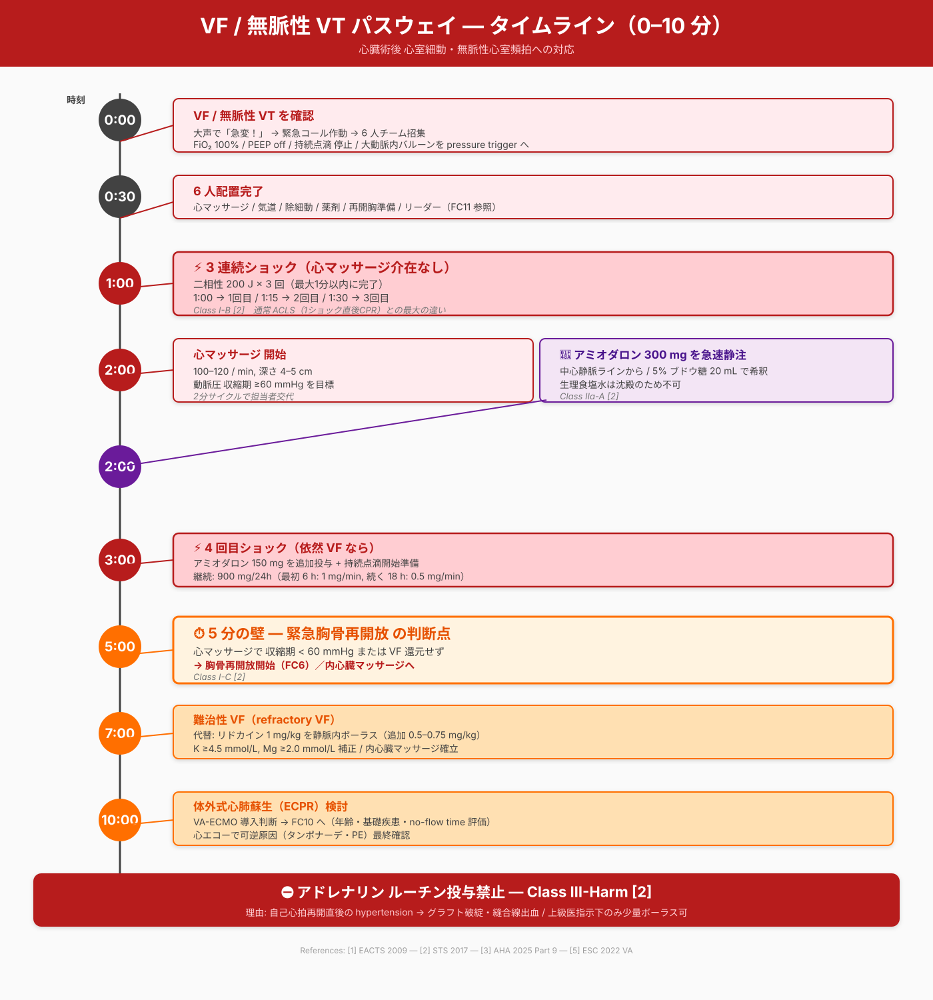

# CVCU 急変対応プロトコル — フローチャート生成プロンプト集

> **目的**: [CVCU_Emergency_Response_Protocol.md](CVCU_Emergency_Response_Protocol.md) 内のASCIIフローチャートを、看護師・医師がベッドサイドで使える視覚的に明瞭な図表に置き換える
> **使い方**: 各セクションのPromptをCodex（または画像/コード生成AI）にコピペして渡す
> **想定生成物**: 各フローチャートにつき下記いずれか
> - **Mermaid.js コード**（GitHub markdown でネイティブレンダリング、推奨）
> - **SVG コード**（高解像度、自由レイアウト、HTML埋め込み可）
> - **PNG/JPG 画像**（最終手段、再編集不可なため非推奨）

---

## 🎨 共通デザインガイドライン（全フローチャートに適用）

下記を**全Promptの先頭で必ず指示**してください:

```
## Design System

### Color palette (CALS convention)
- VF/pVT pathway:        #E53935 (red 600) — 「すぐショック」を意味する強い赤
- Asystole/Brady pathway: #F9A825 (yellow 700) — ペーシング pathway
- PEA pathway:           #43A047 (green 600) — 可逆原因鑑別
- Warning / 5-min wall:  #FF6F00 (deep orange) — 「時間切れ」の警告
- Critical action:       #B71C1C (red 900, bold) — 「絶対やる」 or 「禁止」
- Information / assess:  #1565C0 (blue 800) — 評価・観察
- Drug / dose:           #6A1B9A (purple 800) — 薬剤・量
- Outcome / endpoint:    #2E7D32 (green 800) — ROSC, 成功
- Death / stop:          #424242 (gray 800)

### Typography
- Sans-serif (Noto Sans JP / Helvetica)
- Body 14–16pt, headers 18–24pt
- Drug doses in **bold**
- Critical numbers (60 mmHg, 5 min, 300 mg, etc.) in colored bold

### Iconography (use simple line icons)
- ⚡ shock, 💊 drug, ⏱ timer, 🩺 assess, 🫀 heart, 🩸 bleeding, 💉 IV
- For SVG: use Heroicons or Feather Icons as guide

### Layout
- Top-down flow (preferred) or left-right
- Decision diamonds for branches
- Color-coded boxes per pathway
- Time markers on left edge when applicable
- Citation footer: "[Source: References [n]]"

### Output requirements
- Aspect ratio: 4:3 or 16:9 (printer-friendly)
- Minimum width 1200px for SVG/PNG
- For Mermaid: use `flowchart TD` syntax with class-based styling
- Include both English and Japanese labels where space allows
- Japanese primary, English in parentheses for technical terms
```

---

## 📐 FC1: 急変発見時 初期トリアージ

### Filename suggestion
`fc01_initial_triage.svg` (or `.mmd`)

### Prompt for Codex

```
Generate a clinical decision flowchart titled "CVCU 急変発見時 初期トリアージ
(Initial Triage on Discovering Acute Deterioration)".

Apply the Design System above. Output format: Mermaid flowchart TD with custom
classDef styling for the 3 outcome branches.

CONTENT:

START (rounded box, blue):
  「急変を発見」
  Subtitle: "Patient appears unwell"

STEP 1 (rectangle, blue):
  ① 大声で応援依頼  ("急変！" と叫ぶ)
  ② 緊急コール作動 (Code Blue / Code Stat)
  ③ 10秒以内に反応・呼吸・脈拍チェック

DECISION DIAMOND (yellow):
  反応 / 呼吸 / 脈拍?

THREE OUTCOME BRANCHES:

A. 反応あり・呼吸あり・循環安定 → GREEN box:
   「経過観察」
   - Vital 5分毎
   - Dr. コール
   - 12誘導 ECG
   - 採血 (Tn, electrolytes)

B. 反応あり/弱・呼吸あり・循環不安定 → YELLOW box "Pre-arrest 状態":
   下記アクションを並行
   - 心エコー (タンポナーデ?)
   - 12誘導 ECG (虚血・不整脈)
   - 動脈血液ガス + 乳酸
   - 輸液 500mL bolus 検討
   - 循環器コンサル
   - 再開胸準備（タンポナーデ濃厚時）
   → 状態悪化なら C へ

C. 反応なし or 呼吸停止 or 脈拍なし → RED box "CARDIAC ARREST":
   → FC2 CALS Algorithm へ
   - 6人チーム招集
   - Emergency resternotomy set 展開

Add a "Pre-arrest 原因鑑別" callout box on the right side listing:
タンポナーデ / Tension PTX / 出血性ショック / 急性右心不全/PE /
VF storm 前兆 / 心筋虚血

Footer: "Source: References [1][2][8]"
```

---

## 📐 FC2: CALS Master Algorithm（3分岐統合図）

### Filename suggestion
`fc02_cals_master_algorithm.svg`

### Prompt for Codex

```
Generate a comprehensive cardiac arrest algorithm flowchart titled
"CALS / CSU-ALS Master Algorithm — 心臓術後心停止 統合プロトコル"
based on Dunning J et al. 2009 (EACTS) + 2017 (STS) guidelines.

This is the MASTER FIGURE. Aspect ratio 4:3 portrait or 16:9 landscape — pick
whichever shows all 3 pathways clearly. Use SVG output for high quality.

Apply Design System. Three parallel color-coded pathways below a common header.

═══ COMMON HEADER (top, full width) ═══

Title box: 「CVCU 心停止 → CALS 起動」 (large, bold)

Initial actions box (blue, applies to all pathways):
- FiO₂ 100% / PEEP off / bag-valve に切替
- 両側呼吸音聴取（pneumothorax 除外）
- 全持続点滴・シリンジポンプ 停止 (鎮静のみ継続可)
- IABP は pressure trigger 切替
- 動脈圧 systolic ≥60 mmHg を目標

Rhythm assessment diamond:
「ECG / 動脈圧波形 / EtCO₂ 評価」

THREE BRANCHES BELOW (use 3-column layout):

═══ COLUMN 1: VF / pulseless VT (RED #E53935) ═══

Step 1 (red bold): "3連続ショック (CPR介在なし)"
  - Biphasic 200 J × 3
  - Class I-B [2]

Step 2 (red): "ECM 100–120/min, 深4–5 cm"
  Aim systolic ≥60 mmHg

Step 3 decision: "Systolic <60 mmHg?"
  YES → orange burst "5分以内 再開胸 (FC6)"

Step 4 (purple drug box):
  "Amiodarone 300mg IV (CVL)"
  「中心静脈ライン」"5% GLU 20mL 希釈"
  Class IIa-A [2]

Step 5: "2分後リズム確認 → 依然VF"
  "4回目ショック"
  "Amiodarone 150mg 追加"
  "900mg / 24h 持続点滴"

Step 6: "5回目以降"
  代替: "Lidocaine 1 mg/kg IV"

🚨 WARNING BOX (red border, white bg) below this column:
"⛔ Adrenaline ルーチン投与禁止
Class III-Harm [2]
(再灌流後 hypertension → graft破綻)"

═══ COLUMN 2: Asystole / Severe brady (YELLOW #F9A825) ═══

Step 1 (yellow bold): "心外膜ペーシングワイヤー接続"
  - DDD mode (心房+心室)
  - Rate 80–100 bpm
  - Atrial / Ventricular output 最大 (20 mA)
  - Class IIa-C [2]

Step 2 decision: "Output 戻る?"
  YES → green "ROSC ケア"

Step 3 (yellow): "経皮ペーシング (TCP)"
  - パッド 前-後
  - 80 mA から漸増
  - Capture まで増加

Step 4 (orange critical): "5分以内 緊急再開胸"
  Class I-C [2]

📝 Note box: "STS 2017では Atropine ルーチン非推奨 (Class III)
EACTS 2009 旧版は 3mg single dose 中心静脈"

═══ COLUMN 3: PEA (GREEN #43A047) ═══

Step 1 (green bold): "ペーシング作動中なら一時OFF"
  「基礎リズムに VF 隠れていないか確認」
  Class IIa-C [2]

Step 2 decision: "基礎リズム VF?"
  YES → 矢印 → COLUMN 1 (VF) へ移行

Step 3 (green): "4H / 4T 鑑別"
  4H: Hypoxia / Hypovolemia / Hypo-Hyperkalemia / Hypothermia
  4T: Tamponade★ / Tension PTX / Thrombus / Toxin
  ★ Tamponade は最頻原因

Step 4 (orange critical): "5分以内 緊急再開胸"
  Class I-C [2]

═══ FOOTER (common, full width) ═══

Big orange banner: "⏱ 5分の壁 — 5 min wall"
"非VF/VT が pacing/可逆原因対応に反応せず → Emergency Resternotomy (FC6)"

Citation footer (small, gray):
"References: [1] Dunning 2009 EACTS, [2] Dunning 2017 STS"

Connect with arrows, use clinically intuitive icons.
```

---

## 📐 FC3: VF / pVT 詳細経路（時系列付き）

### Filename suggestion
`fc03_vf_pvt_pathway.svg`

### Prompt for Codex

```
Generate a time-based detailed pathway flowchart titled
"VF / pulseless VT Pathway — タイムラインベース"

This visualizes the first 10 minutes of VF arrest in CVCU.

Apply Design System. Use LEFT EDGE for time markers (vertical timeline), right
side for actions. Aspect ratio: portrait 3:4.

TIME MARKERS (left, vertical timeline):
0:00 / 0:30 / 1:00 / 1:30 / 2:00 / 3:00 / 4:00 / 5:00 / 7:00 / 10:00

ACTIONS at each time (right):

0:00 (red): VF/pVT 確認
  - 大声で "急変！"
  - 緊急コール
  - 6人チーム招集

0:30 (red): 6人配置完了
  - Role assignments (link to FC11)

1:00 (red bold): 1回目 ショック
  - Biphasic 200 J
  - "Defibrillator paddles に "Charging..."

1:15 (red): 2回目 ショック
  - Same energy

1:30 (red): 3回目 ショック
  - 「3連続shock 完了」

1:30 onward (red): ECM 開始
  - 100–120/min
  - 深 4–5 cm
  - Aim systolic ≥60 mmHg
  - 2分サイクル

2:00 (purple drug): Amiodarone 300 mg IV
  - 中心静脈ライン
  - 5% glucose 20 mL 希釈
  - Reference [1][2]

3:00 (red): 2分後リズム確認 → 4回目ショック (if still VF)
  - 持続点滴開始準備:
    Amiodarone 900 mg / 24h
    1st 6h: 1 mg/min
    Next 18h: 0.5 mg/min

3:00–5:00 (gray): 再開胸チーム gown+glove (closed-glove)
  - Set 展開
  - Drape 準備

5:00 (ORANGE BOLD, large): ⏱ 5分の壁
  "ECM systolic <60 mmHg or 還元せず → 内マッサージへ"

5:00–7:00 (red): Emergency Resternotomy (FC6)
  - Wire cutting
  - Internal cardiac massage 100–120/min
  - Internal defibrillation if needed

7:00+ (red): Refractory VF
  - Lidocaine 1 mg/kg IV (alternative)
  - Consider Mg, K supplementation
  - VA-ECMO / IMPELLA (ECPR) 検討 (FC10)

10:00+ (gray): Reassess viability
  - Team leader 判断
  - 5H/5T 再評価

🚨 RED PERSISTENT WARNING (右下バナー, large):
"⛔ Adrenaline ルーチン投与禁止 — Class III Harm [2]"
"理由: ROSC 後 hypertension → graft 破綻"

Footer citation: References [1][2]
```

---

## 📐 FC4: Asystole / Severe Bradycardia 詳細経路

### Filename suggestion
`fc04_asystole_pathway.svg`

### Prompt for Codex

```
Generate a flowchart titled "Asystole / Severe Bradycardia Pathway"

Apply Design System. Yellow #F9A825 dominant theme. Portrait 3:4 or square.

START (yellow): Asystole or HR <30 bpm with hemodynamic collapse

STEP 1 (yellow box):
  心外膜ペーシングワイヤー 状態確認
  - 接続 (Atrial + Ventricular wires)
  - DDD mode at 80–100 bpm
  - Atrial output 20 mA (MAX)
  - Ventricular output 20 mA (MAX)
  - Atrial sens 0.5 mV
  - Ventricular sens 2 mV
  Class IIa-C [2]

⚠️ NOTE callout (yellow border):
  "Emergency setting ボタンは V00 にする機種が多い
  心臓術後は心房ワイヤーのみ接続のケース多い
  → V00 では効果なし"

DECISION (diamond): "Capture (有効ペーシング)?"

YES → green ROSC box

NO → STEP 2 (yellow):
  経皮ペーシング (TCP) へ切替
  - パッド 前-後 (sternum + interscapular) or 前-側
  - Rate 80 bpm
  - Output 80 mA から開始
  - Capture まで漸増 (typically 100–140 mA)
  - 強い疼痛 → ミダゾラム + フェンタニル

DECISION 2: "TCP capture & 循環安定?"

YES → green: 経静脈ペーシング (TVP) 挿入準備
  - 内頸 or 鎖骨下静脈
  - Rate 80, Output 5 mA

NO → orange critical: 5分以内 緊急再開胸 (FC6)
  Class I-C [2]

📝 STS 2017 update note (gray small text):
"Atropine ルーチン非推奨 (Class III-no benefit)
ペーシング優先"

📝 EACTS 2009 旧版参考 (gray italic):
"Atropine 3 mg 単回, 中心静脈経由 [1]"

Footer: References [1][2]
```

---

## 📐 FC5: PEA 経路 + 4H/4T 鑑別

### Filename suggestion
`fc05_pea_pathway_4h4t.svg`

### Prompt for Codex

```
Generate a flowchart titled "PEA Pathway — 心臓術後特異 4H/4T 鑑別"

Apply Design System. Green #43A047 dominant. Include a parallel right-side
panel for 4H/4T differential boxes. Aspect 16:9 landscape.

LEFT COLUMN: Decision flow

START (green): PEA 確認 (organized rhythm but no pulse/arterial trace)

STEP 1 (green):
  "ペーシング作動中なら 一時OFF"
  → 基礎リズム re-evaluate (VF 隠蔽除外)
  Class IIa-C [2]

DECISION: "基礎リズム VF?"
  YES → arrow to FC3 (VF pathway)
  NO → continue

STEP 2 (green): ECM 継続 + 4H/4T 鑑別 を並行

STEP 3 (orange critical): 5分以内 緊急再開胸 (FC6)
  Class I-C [2]

RIGHT PANEL: 4H/4T Differential cards (each ~ 100x100px tile)

4 H's row:

Tile 1 — Hypoxia
  Icon: 🫁
  Action:
  - SpO₂ 100% O₂
  - 両側 呼吸音 listen
  - ETT 位置確認 + EtCO₂

Tile 2 — Hypovolemia (★高頻度)
  Icon: 💧
  Action:
  - ドレーン排液確認
  - 心エコー (IVC, RV evaluation)
  - 輸液 500 mL ボーラス
  - 輸血準備

Tile 3 — Hypo-/Hyperkalemia
  Icon: ⚡
  Action:
  - ABG (K, glucose)
  - 高K → CaCl₂ 1g → insulin/glucose → NaHCO₃ → β-agonist

Tile 4 — Hypothermia
  Icon: 🌡
  Action:
  - 中心温 < 32°C → 加温

4 T's row:

Tile 5 — Tamponade (★最頻 in CVCU)
  Icon: 🩸
  Bold border (most common)
  Action:
  - 心エコー (FAST cardiac view)
  - CVP 急上昇 / narrow pulse
  - → 5分以内 再開胸
  - 「ECMで systolic <60 mmHg → タンポナーデ濃厚」

Tile 6 — Tension PTX
  Icon: 🫁
  Action:
  - 片肺音 + 頸静脈怒張
  - 14G 第2肋間 鎖骨中線 穿刺 [2]
  - 胸腔ドレーン挿入

Tile 7 — Thrombus (PE / coronary)
  Icon: 🚫
  Action:
  - 心エコー RV 評価
  - 過去 DVT/PE 既往?
  - 緊急 CTPA (蘇生後)

Tile 8 — Toxin / Drug
  Icon: 💊
  Action:
  - 全持続点滴 停止
  - 直近の薬剤 review
  - Naloxone, flumazenil 考慮

Footer: References [1][2][3]
```

---

## 📐 FC6: 緊急胸骨再開放 手順図

### Filename suggestion
`fc06_emergency_resternotomy_procedure.svg`

### Prompt for Codex

```
Generate a step-by-step procedural diagram titled
"Emergency Resternotomy — 緊急胸骨再開放 手順"

Apply Design System. Orange #FF6F00 (warning) theme. Portrait. Include
small anatomical sketch of midline sternotomy.

LAYOUT: 8 sequential steps in a vertical sequence, each with:
- Step number (large)
- Action description (Japanese + English)
- Key personnel involved
- Time estimate
- Critical safety note

STEP 1 — 心停止確認 (0:00)
  「Cardiac arrest 宣言」
  Personnel: Team Leader
  - 緊急コール作動

STEP 2 — チーム gown/glove (0:00–0:30)
  「2–3名 滅菌ガウン + closed-glove法」
  Personnel: Resternotomy team
  Safety: 手洗い不要 (closed-glove で対応) [1]

STEP 3 — Set 展開 (0:30–1:00)
  「Emergency Resternotomy Set 展開」
  Required (5 items only) [2]:
    ① Disposable scalpel
    ② Wire cutter
    ③ Heavy needle holder
    ④ Single-piece sternal retractor
    ⑤ Suction
  + All-in-one drape

STEP 4 — Drape (1:00–1:30)
  「ECM継続のままドレープ施行」
  Personnel: Surgeon + Assistant

STEP 5 — 切開 (1:30–2:00)
  「Scalpel で sternotomy 創を ワイヤーまで切開」
  Personnel: Surgeon
  Safety: 既存の suture 全て切断

STEP 6 — ワイヤー切断・抜去 (2:00–3:00)
  「2人作業」
  - 1人がワイヤーカッターで切断
  - 別の人が heavy needle holder で抜去
  - 「ペアで作業すると大幅に時間短縮」 [2]

STEP 7 — Retractor (3:00–3:30)
  「Sternal retractor 挿入 → 胸骨開大」
  - タンポナーデは この時点で解放されることが多い
  - 吸引で血液・凝塊除去

STEP 8 — 心拍出評価 (3:30–4:00)
  Decision:
  - 心拍出 回復 → ROSC ケアへ
  - 心拍出 なし → 内心臓マッサージへ (FC6b)

FOOTER 1 — Internal Cardiac Massage Technique
  「Two-handed technique 推奨」 [2]
  - 左手で心尖を覆う
  - 右手を心室前面に置く
  - 両手を 100–120/min で圧迫
  - 目標 systolic ≥80 mmHg [2]
  - 僧帽弁術後は心尖を持ち上げない (後壁破裂risk) [2]

FOOTER 2 — Post-procedure
  「Class IIa-B [2]: 完全な無菌操作が困難な場合、
   創部洗浄 + IV 抗菌薬追加」

Add an anatomical inset diagram showing:
- Midline sternotomy incision
- Sternal wire positions
- Internal mammary graft locations (LIMA caution)
- Heart with grafts

Footer citation: References [1][2]
```

---

## 📐 FC7: VF Storm / Electrical Storm エスカレーション

### Filename suggestion
`fc07_electrical_storm_escalation.svg`

### Prompt for Codex

```
Generate an escalation pathway flowchart titled
"VF Storm / Electrical Storm Escalation Pathway"

Apply Design System. Red #E53935 with orange escalation. Aspect 9:16 portrait.

Show 8-step pyramid/staircase, with parallel "reversible causes" lane on left.

TITLE: "Electrical storm = 24時間以内に ≥3 回の sustained VA [5]"

LEFT LANE — Reversible Causes (run parallel throughout, blue):
  ✓ K ≥4.5 mmol/L
  ✓ Mg ≥2.0 mmol/L
  ✓ 急性虚血 評価 → 12誘導 ECG → §9 ACS へ
  ✓ 発熱・敗血症・低酸素
  ✓ QT延長薬中止
  ✓ ICDワイヤー異常 → magnet で disable

CENTER STAIRCASE (8 steps, increasing severity):

STEP 1 (blue): 鎮静 (Class I-C [5])
  - デクスメデトミジン or ミダゾラム
  - 交感神経 tone 低下

STEP 2 (purple drug): β-blocker + Amiodarone IV (Class I-B [5])
  - 非選択性β-blocker 優先 (Propranolol)
  - 院内: Esmolol 100µg/kg → 10–40µg/kg/min
        or Landiolol 100µg/kg → 10–40µg/kg/min [5]
  - Amiodarone 5 mg/kg over 20 min, 反復可
  - 600–1200 mg / 24h × 8–10日

STEP 3 (red): 不安定 → DC同期カルジオバージョン (Class I-B [5])
  - Biphasic 150–200 J
  - 必要なら 360 J

STEP 4 (purple): TdP/多形性VT なら → FC8

STEP 5 (orange critical): 深鎮静・全身麻酔 + 挿管 (Class IIa-C [5])
  - 交感神経完全遮断

STEP 6 (red): Early ablation (Class I-B [5])
  - 専門施設へ転送 検討
  - Trigger PVC mapping

STEP 7 (red): 機械的循環補助 (Class IIb [5])
  - VA-ECMO / IMPELLA → FC10

STEP 8 (gray dashed): 自律神経 modulation (Class IIb [5])
  - 星状神経節ブロック
  - 左心交感神経除神経 (LCSD)

DRUG INFO BOX (purple, right side):
"Amiodarone 投与速度 ≤50 mg/min を超えない
 → 徐脈・低血圧リスク [5]"

"TdP には Amiodarone・Sotalol 禁忌 [5]
 (QT さらに延長)"

Footer: References [3][5]
```

---

## 📐 FC8: Torsades de Pointes 分岐

### Filename suggestion
`fc08_torsades_de_pointes.svg`

### Prompt for Codex

```
Generate a differential management flowchart titled
"Torsades de Pointes — 多形性VT / QT延長 鑑別と治療"

Apply Design System. Purple/red mix. Square or landscape.

START: 多形性VT 確認 (twisting QRS axis on ECG)

DECISION DIAMOND: QT 延長?

THREE BRANCHES:

A. 後天性 LQT-TdP (最頻 — orange box):
  特徴: QT延長 + 誘因薬剤 / 電解質異常 / 徐脈
  Treatment cascade:
    1. 誘因薬剤 中止
       (sotalol, dofetilide, haloperidol,
        fluoroquinolone, macrolide)
    2. 電解質補正
       - K ≥4.5 mmol/L
       - Mg ≥2.0 mmol/L
    3. MgSO₄ IV (Class I-C [5])
       - 1–2 g IV bolus over 1–2 min
       - 5% GLU / NS 10 mL 希釈
       - Loading 400 mg → 持続 600 mg/24h
    4. HR 上昇 (Class I-C [5])
       - Isoproterenol 持続 → HR 80–100
       - 経皮 / 経静脈ペーシング 80–100/min
    5. 不安定 → 非同期 high-energy shock

B. 先天性 LQT-TdP (red box):
  特徴: 若年, 既往あり, 家族歴, 運動・聴覚trigger
  Treatment:
    - β-blocker (nadolol, propranolol) Class I [5]
    - 誘因回避 (QT延長薬 strict avoid)
    - ICD 検討
    - LCSD (左心交感神経除神経) Class IIb [5]

C. 多形性VT (QT正常 — red box):
  特徴: 急性虚血, 心臓術後, 構造的心疾患
  Treatment:
    - 虚血治療 (FC9 へ)
    - β-blocker IV
    - Amiodarone IV (Class IIa for SMVT [5])
    - Lidocaine IV alternative

🚫 BIG WARNING BOX (red, full width footer):
"⛔ TdP に Amiodarone・Sotalol は禁忌"
"QT さらに延長 → 悪化"
[5] ESC 2022

Footer: References [3][5]
```

---

## 📐 FC9: 術後POAF 急性期対応

### Filename suggestion
`fc09_postop_af_management.svg`

### Prompt for Codex

```
Generate a clinical decision flowchart titled
"術後新規心房細動 (POAF) 急性期対応"

Apply Design System. Blue/purple mix. Square aspect.

EPIDEMIOLOGY HEADER (small text bar, top):
"発症率: CABG 20–30% / 弁手術 30–40% / 複合 40–50%"
"70%は POD 4 まで、90%は POD 7 まで [6]"

START: 新規 POAF 発見 (ECG確認)

STEP 1 (blue): 12誘導 ECG + HR/BP/SpO₂ チェック

DECISION DIAMOND (large): "血行動態?"

TWO BRANCHES:

A. 不安定 (red bold) — SBP <90, 虚血sign, 意識低下:
  → 同期DC カルジオバージョン
    Class I-C [6]
    Biphasic 100–200 J
    鎮静要 (ミダゾラム + フェンタニル or プロポフォール)

B. 安定 (green): Rate vs Rhythm control どちらも妥当
  Class IIb-B [6]
  → 個別判断

  SUB-BRANCH B1 — Rate control:
    🔵 Metoprolol IV (purple drug):
       2.5–5 mg slow push, 反復可
       HR<60 or SBP<100 → 中止 [6]
    🔵 Esmolol IV:
       100 µg/kg over 1 min →
       10–40 µg/kg/min [5]
    🔵 Landiolol IV (心機能低下例):
       100 µg/kg over 1 min →
       10–40 µg/kg/min [5]
    🔵 Diltiazem IV (β-blocker 禁忌時):
       0.25 mg/kg (max 20mg) over 2 min →
       5–15 mg/h
       LV機能低下では避ける [6]
    🔵 Digoxin: 限定的, 効果遅い [6]

  SUB-BRANCH B2 — Rhythm control:
    🟣 Amiodarone IV protocol (purple, prominent):
       ┌─────────────────────────────┐
       │ Phase 1 (0–15 min):         │
       │   300 mg over 10–15 min     │
       │   in 5% GLU 100 mL          │
       │   中心静脈推奨               │
       ├─────────────────────────────┤
       │ Phase 2 (15 min–6 h):       │
       │   1 mg/min × 6h             │
       │   (total 360 mg)            │
       ├─────────────────────────────┤
       │ Phase 3 (6 h–24 h):         │
       │   0.5 mg/min × 18h          │
       │   (total 540 mg)            │
       ├─────────────────────────────┤
       │ Daily total: ~1200 mg       │
       └─────────────────────────────┘

STEP 3 — Anticoagulation decision (yellow box):
  Class IIb-B [6] — 個別判断
  Consider if:
    - 左側弁手術
    - CHA₂DS₂-VASc ≥4
  Hold if:
    - 単独 CABG + CHA₂DS₂-VASc <4
    - 活動性出血 / chest tube 出血継続
  Agent: DOAC > VKA (出血少, Class IIb-B [6])
  Exception: 機械弁置換後 → VKA 必須

PREVENTION SIDEBAR (left, gray):
"周術期予防 [6]:
  - 経口 Amiodarone (Class I-B)
  - β-blocker 継続 (Class IIa-B)
  - 左後心膜切開 (Class IIa-B)
  - Mg IV (Class IIb-B)
  - Colchicine (Class IIb-B)
  - 両心房 pacing (Class IIb-B)
  ❌ ルーチン K 補正 (Class III)"

Footer: References [5][6]
```

---

## 📐 FC10: VA-ECMO / IMPELLA Configuration Diagram

### Filename suggestion
`fc10_va_ecmo_impella_setup.svg`

### Prompt for Codex

```
Generate a hybrid anatomical/operational diagram titled
"VA-ECMO + IMPELLA — 機械的循環補助 セットアップ"

Apply Design System. Use anatomical body outline. Landscape 16:9.

LEFT PANEL: Patient body schematic (anterior view) showing:
  - Heart with chambers
  - Aorta, pulmonary artery
  - Femoral vessels
  - Right axillary access (alternative)
  - VA-ECMO cannulas with labels:
    * Venous cannula 21–23 Fr in femoral vein → RA
    * Arterial cannula 15–17 Fr in femoral artery (retrograde to aorta)
    * Distal perfusion cannula (DPC) 4–7 Fr in ipsilateral SFA
  - IMPELLA inserted via femoral artery → LV
  - Color blood flow arrows (red = oxygenated, blue = deoxygenated)
  - ECMO pump + oxygenator box outside body

RIGHT PANEL: Configuration & monitoring parameters

CANNULATION SPEC BOX (gray):
  動脈側: 15–17 Fr (重症例 19 Fr)
  静脈側: 21–23 Fr
  DPC: 4–7 Fr (同側 SFA) — 下肢虚血予防 (Class I-B [7])

ANTICOAGULATION BOX (purple):
  初期: Heparin 50 U/kg IV bolus
  ACT 目標: 180–200 秒
  APTT 目標: 50–60 秒
  抗Xa: 0.3–0.7 U/mL

CIRCULATION TARGET BOX (green):
  ECMO flow: 2.4–4.8 L/min/m²
  MAP ≥65 mmHg
  右橈骨動脈 SpO₂ ≥95% (北南症候群除外)
  ScvO₂ ≥70%
  乳酸: 経時低下

IMPELLA SPEC TABLE (small):
  ┌────────┬────────┬─────────┬────────────┐
  │ 機種    │ Flow   │ 太さ     │ 適応        │
  ├────────┼────────┼─────────┼────────────┤
  │ 2.5    │ 2.5L   │ 12 Fr   │ HR-PCI     │
  │ CP     │ 3.7L   │ 14 Fr   │ CS         │
  │ 5.0    │ 5.0L   │ 21 Fr   │ 重症CS外科  │
  │ 5.5    │ 5.5L   │ 21 Fr   │ 重症CS外科  │
  └────────┴────────┴─────────┴────────────┘

ECPELLA NOTE (yellow):
  "VA-ECMO + IMPELLA = ECPELLA"
  適応: PAWP上昇, 肺うっ血
  目的: 左室減圧, 肺うっ血改善,
       心筋酸素消費低下

COMPLICATIONS WATCH (red bordered):
  - 下肢虚血 17% → DPC, 下肢色温度毎時
  - 北南症候群 → 右橈骨動脈 SpO₂
  - 溶血 → LDH, free Hb (q4–6h)
  - 出血 → 穿刺部, 脳出血 (頭部CT)

WEANING CRITERIA BOX (green):
  PAWP <15 mmHg
  CI >2.0 L/min/m²
  LVEF >30%
  心エコー: 壁運動改善
  乳酸正常化

Footer: References [7]
```

---

## 📐 FC11: 6人チーム ロール配置図（ベッドサイドレイアウト）

### Filename suggestion
`fc11_six_person_team_layout.svg`

### Prompt for Codex

```
Generate a top-down bedside layout diagram titled
"CALS 6-Person Team — ベッドサイド配置図"

Apply Design System. Bird's-eye view of patient on bed with 6 team
positions marked. Square aspect.

CENTER: Patient on bed (top of bed = patient head, bottom = feet)

6 POSITIONS around bed (each with role card):

Position 1 — 患者右側 胸部レベル
  Role 1: 心マ担当 (External Cardiac Massage)
  Card content:
  - 100–120/min, 深 4–5 cm
  - 動脈圧 systolic ≥60 mmHg を目標
  - <60 → "再開胸要" と宣言
  - 2分ごと交代

Position 2 — 患者頭側
  Role 2: 気道・呼吸
  Card content:
  - FiO₂ 100% / PEEP off
  - Bag-valve 換気
  - 両肺聴診 (PTX 除外)
  - ETT 確認 + capnography

Position 3 — 患者左側 胸部レベル
  Role 3: 除細動 + ペーシング
  Card content:
  - Biphasic 200 J × 3 連続
  - DDD 80–100 bpm, max output
  - 内除細動 paddle 準備

Position 4 — 患者左側 足元
  Role 4: 薬剤・ライン
  Card content:
  - 全持続点滴 停止
  - 鎮静のみ継続可
  - IABP → pressure trigger
  - Amiodarone 準備
  - ❌ Adrenaline ルーチン禁止

Position 5 — 患者右側 足元
  Role 5: 再開胸準備
  Card content:
  - Gown + closed-glove
  - Emergency set 展開
  - All-in-one drape
  - 内除細動 paddle

Position 6 — ベッド外、近隣
  Role 6: Team Leader / Coordinator
  Card content:
  - 全体指揮
  - 5分タイマー
  - Senior + 外科オンコール 呼出
  - 家族連絡
  - 記録

LEGEND:
  - Color-code roles
  - Show direction of action (e.g., compressor faces patient)
  - Indicate communication paths between roles
  - 「Team Leader is the only one without hands on patient」 emphasized

Equipment positions:
  - Defibrillator: head left
  - Emergency cart: foot of bed
  - Resternotomy set table: patient right at foot
  - Monitor: head right

Footer: References [1][2]
```

---

## 📐 FC12: タイマー / Timeline 0–10分

### Filename suggestion
`fc12_response_timeline.svg`

### Prompt for Codex

```
Generate a horizontal timeline diagram titled
"CVCU 心停止 対応タイムライン (0–10 min)"

Apply Design System. Landscape 16:9. Horizontal time axis 0–10 min.

X-AXIS: Time (0:00 to 10:00, intervals at 0:00, 0:30, 1:00, 2:00, 3:00, 4:00, 5:00, 7:00, 10:00)

Y-AXIS: 4 parallel swimlanes
  Lane A (top): Team Leader actions
  Lane B: Clinical actions (CPR, shocks, drugs)
  Lane C: Resternotomy team prep
  Lane D (bottom): Equipment / Logistics

LANE A — Team Leader:
  0:00 — Cardiac arrest 宣言, 緊急コール
  0:30 — Role assignments confirm
  1:00 — Senior 呼出
  2:00 — 心臓外科オンコール 呼出
  4:00 — 再開胸決定準備
  5:00 — ⏱ 再開胸 GO 指示 (if needed)

LANE B — Clinical:
  0:00 — Rhythm assessment (10 sec)
  1:00 — Shock 1
  1:15 — Shock 2
  1:30 — Shock 3 → CPR 開始
  2:00 — Amiodarone 300 mg
  3:00 — Shock 4 (if VF persists)
  3:30 — Amiodarone 150 mg 追加
  5:00 — ECM systolic <60 → 内マッサージ
  7:00 — Lidocaine 1 mg/kg (alt)
  10:00 — ECPR 検討

LANE C — Resternotomy:
  0:30 — Gown + closed-glove
  1:00 — Set 展開
  1:30 — Drape 準備
  2:00 — Scrub 完了
  3:00 — 切開準備
  5:00 — ⚡ Sternotomy start
  6:00 — Wire 抜去
  7:00 — Retractor 挿入
  7:30 — 内心臓マッサージ

LANE D — Equipment:
  0:00 — Defib 持ち込み
  0:30 — Code cart 持ち込み
  1:00 — Defib paddles 装着, charge
  2:00 — IV/CVL flush 確認
  3:00 — IABP pressure trigger 切替
  5:00 — 内除細動 paddle
  10:00 — ECMO console 準備 (if ECPR)

CRITICAL VERTICAL MARKERS:
  - 5:00 — ⚠️ 「5分の壁」 large orange band across all lanes
  - 10:00 — ECPR decision point

Color code each lane with subtle background.
Add prominent "Decision points" diamonds at 4:00 (resternotomy go/no-go) and
10:00 (ECPR or terminate).

Footer: References [1][2]
```

---

## 🔧 Codex への一括指示テンプレート

下記を最初のプロンプトとして送信し、FC1〜FC12 をまとめて生成依頼:

```
あなたは医療フローチャートの専門デザイナーです。CVCU（心臓外科術後 step-down ICU）
で看護師・医師がベッドサイドで使う 12 枚のフローチャートを作成します。

# 共通要件
1. 出力形式: **Mermaid.js コード** 優先（GitHub markdown でネイティブレンダリング可）
   - 複雑すぎる場合は SVG コード（インラインHTML埋め込み可）にフォールバック
   - 画像生成は最終手段（PNG/JPG は再編集不可のため）

2. デザインシステム:
   [この MD ファイルの「Design System」セクションを引用]

3. ファイル命名: `fc01_initial_triage.mmd` 等

4. 各フローチャートの末尾に必ず引用 footer を付ける

5. 日本語ラベル primary, 英語は技術用語のみ括弧書き

# 生成順序
FC1 → FC2 → FC3 → ... → FC12

# 出典文献（番号は本文書と一致）
[1] EACTS CALS 2009 (Dunning et al., DOI: 10.1016/j.ejcts.2009.01.033)
[2] STS CSU-ALS 2017 (Dunning et al., DOI: 10.1016/j.athoracsur.2016.11.018)
[3] AHA 2025 Part 9 Adult ALS (Wigginton et al., DOI: 10.1161/CIR.0000000000001376)
[4] JRC ACS Executive Summary 2023 (Kikuchi et al., DOI: 10.1253/circj.CJ-23-0096)
[5] ESC 2022 VA/SCD (Zeppenfeld et al., DOI: 10.1093/eurheartj/ehac262)
[6] STS 2026 Post-op AF (Chatterjee et al., DOI: 10.1016/j.athoracsur.2026.04.002)
[7] JCS 2023 PCPS/ECMO/IMPELLA (DOI: 10.1253/circj.CJ-23-0698)
[8] ERAS Cardiac 2019 (Engelman et al., DOI: 10.1001/jamasurg.2019.1153)

# 出力
各フローチャート毎に separate code block で出力してください。
レンダリング後の preview を可能なら同時提示してください。

# 次のメッセージで FC1 から順に Prompt を送ります。
```

---

## 📁 生成後のファイル配置

```
CVCU_Emergency_Response/
├── CVCU_Emergency_Response_Protocol.md   (既存)
├── CVCU_Emergency_Response_Protocol.html (既存)
├── Flowchart_Generation_Prompts.md      (本ファイル)
└── flowcharts/
    ├── fc01_initial_triage.svg
    ├── fc02_cals_master_algorithm.svg
    ├── fc03_vf_pvt_pathway.svg
    ├── fc04_asystole_pathway.svg
    ├── fc05_pea_pathway_4h4t.svg
    ├── fc06_emergency_resternotomy_procedure.svg
    ├── fc07_electrical_storm_escalation.svg
    ├── fc08_torsades_de_pointes.svg
    ├── fc09_postop_af_management.svg
    ├── fc10_va_ecmo_impella_setup.svg
    ├── fc11_six_person_team_layout.svg
    └── fc12_response_timeline.svg
```

生成後、Protocol.md の各章のASCIIフローチャートを下記のように差し替え:

```markdown
### 2.3 VF / pulseless VT パスウェイ



> 詳細解説 [本文へ]
```

---

## ✅ チェックリスト（生成後の検証項目）

各フローチャートで確認:

- [ ] 引用文献番号 [n] が本文の同番号と一致
- [ ] 薬剤量・希釈・経路の数値が本文と一致
- [ ] Class of Recommendation 表記が正確
- [ ] CALSカラー convention (赤/黄/緑) 遵守
- [ ] 5分の壁 (orange) が明示されている
- [ ] Adrenaline 禁止警告 (Class III-Harm) が VF/VT 図に表示
- [ ] 日本語/英語ラベル両方表示
- [ ] 印刷時に文字が読める（最低 10pt 相当）
- [ ] モバイル表示でも判読可能

---

**作成日**: 2026-05-19
**対象**: [CVCU_Emergency_Response_Protocol.md](CVCU_Emergency_Response_Protocol.md)
