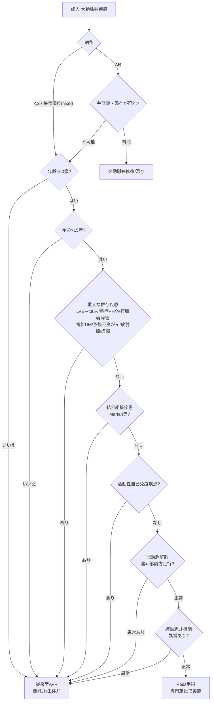
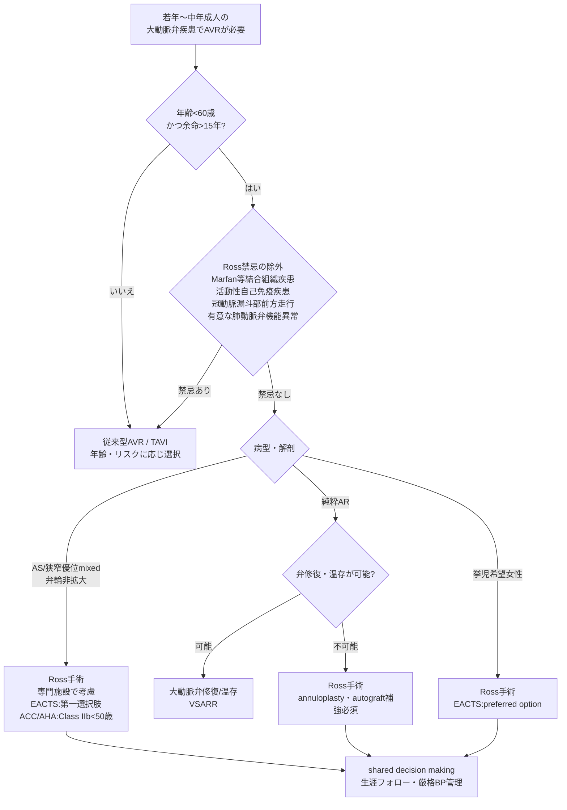

# Ross手術（自己肺動脈弁による大動脈弁置換）：ガイドライン・提言まとめ

**作成日：** 2026年5月20日  
**対象範囲：** 成人Ross手術（小児・先天性は対象外）  
**対象文書：**
- 🇪🇺 **EACTS 2025 Ross Consensus**（中心文書）：EACTS Expert Consensus Statement on the Ross Procedure in Adult Patients（Vojáček J, Gofuš J, et al. *Eur J Cardiothorac Surg* 2026;68(2):ezaf295. Advance access 2025年10月9日）— Ross手術を主題とする唯一の国際専門コンセンサス
- 🇺🇸 **ACC/AHA 2020**：2020 ACC/AHA Guideline for the Management of Patients With Valvular Heart Disease（VHDガイドライン内でRossに言及）
- 🇪🇺 **ESC/EACTS 2025**：2025 ESC/EACTS Guidelines for the management of valvular heart disease（VHDガイドライン内でRossに言及）
- 🇯🇵 **JCS 2020**：JCS/JSCS/JATS/JSVS 2020年改訂版 弁膜症治療ガイドライン（成人Rossの明示的記載なし）

**関連ドキュメント：** [[AS_AVR_Guidelines_Comparison|AS/AVR/TAVIガイドライン比較（第9章にRoss要約あり）]] · [[AR_Guidelines_Comparison|大動脈弁逆流症ガイドライン比較]] · [[Ascending_Aorta_Surgery_Indications_Guideline_Comparison|上行大動脈手術適応比較]] · [[Combined_VHD_Guidelines_Comparison|複合弁膜症ガイドライン比較]] · [[IE_Surgery_Guidelines_Comparison|感染性心内膜炎手術ガイドライン比較]] · [[Perioperative_Anticoagulation_Guidelines_Comparison|術前抗凝固管理比較]]

> [!abstract] 本まとめの位置付け
> Ross手術（自己肺動脈弁＝pulmonary autograftを大動脈位に移植し、右室流出路を肺動脈ホモグラフト等で再建する術式）について、4文書を横断的に整理する。3地域のVHDガイドライン（JCS / ESC/EACTS / ACC/AHA）はいずれもRossへの言及が限定的であるため、本まとめは2025年に発表された **EACTS成人Ross専門コンセンサス** の推奨（6つのConsensus Statement Table）を中核に据え、各VHDガイドラインとの温度差を明確化する。

---

## 目次

1. [Ross手術とは — 概要と術式の変遷](#1-ross手術とは--概要と術式の変遷)
2. [4文書におけるRoss手術の位置付け](#2-4文書におけるross手術の位置付け)
3. [Ross手術の理論的根拠（EACTS Consensus Table 1）](#3-ross手術の理論的根拠eacts-consensus-table-1)
4. [患者選択（EACTS Consensus Table 2）](#4-患者選択eacts-consensus-table-2)
5. [適応疾患別の推奨](#5-適応疾患別の推奨)
6. [手術手技（EACTS Consensus Table 3）](#6-手術手技eacts-consensus-table-3)
7. [再手術・遠隔期成績（EACTS Consensus Table 4）](#7-再手術遠隔期成績eacts-consensus-table-4)
8. [術後管理（EACTS Consensus Table 5）](#8-術後管理eacts-consensus-table-5)
9. [Ross Centres of Excellence（EACTS Consensus Table 6）](#9-ross-centres-of-excellenceeacts-consensus-table-6)
10. [各文書の比較・総括](#10-各文書の比較総括)

---

## 1. Ross手術とは — 概要と術式の変遷

### 1-1. 定義と基本コンセプト

Ross手術は、病的な大動脈弁を**患者自身の肺動脈弁（自己肺動脈弁／pulmonary autograft, PA）**で置換し、摘出した肺動脈弁の位置を**肺動脈ホモグラフト等で再建**する術式である（1967年 Donald Rossが報告）。

> [!info] Ross手術が「生きた弁」である意義
> 移植後数年を経た自己肺動脈弁の組織学的検討では、内皮・間質細胞を備えた三層構造が保たれており、Ross手術は**唯一、移植後も自己組織として生存し続ける大動脈弁置換術(AVR)**である。自己肺動脈弁は左室流出路(LVOT)–大動脈基部complexのダイナミクスと連動性を保持し、これが成人での観察された臨床的有益性（優れた血行動態・低い血栓原性・感染抵抗性）の多くを説明すると考えられている。

### 1-2. 術式の変遷（subcoronary → root replacement → 補強・inclusion）

| 術式 | 概要 | 現在の位置付け |
|-----|------|--------------|
| **Subcoronary (SC)** | 原法。自己肺動脈弁を弁尖単位で大動脈弁位に縫着 | 大動脈基部形態の影響を受けやすく再現性に乏しいため**徐々に減少** |
| **Root replacement (RR)** | 自己肺動脈をfree-standing root として移植。適用範囲が広い | 初期は中期のPA拡張・AR・再手術増加が問題に |
| **Reinforced root replacement (RR+R)** | RRにbasal ring・STJレベルの補強を追加し弁輪mismatchに対応 | **現在の標準術式**（German Ross Registryで非補強RRは再手術6倍） |
| **Autologous inclusion** | 自己肺動脈を患者自身の大動脈根部内に挿入（Skillington法） | 横・縦方向の拡張を抑制。最長30年の良好な耐久性報告 |
| **Prosthetic inclusion** | 自己肺動脈をDacron人工血管内に挿入 | 弁輪・基部径を安定化。少なくとも10年の安全性・耐久性 |
| **Ross-PEARS** | Personalised External Aortic Root Support でautograftを外部補強 | 新規術式。中長期データは限定的 |

---

## 2. 4文書におけるRoss手術の位置付け

> [!warning] 最重要ポイント：ガイドライン間の「温度差」
> 3地域のVHDガイドラインはRoss手術に**慎重〜記載なし**であるのに対し、**EACTS 2025 Ross専門コンセンサス**は近年蓄積した長期成績エビデンスに基づき、適切な患者選定と専門施設での実施を条件として**第一選択肢としての考慮**を明示する、より積極的な姿勢をとる。この乖離自体が、Ross手術を巡る現在の臨床的論点である。

| 文書 | Ross手術の推奨レベル | 主な記載内容（要点） |
|------|-------------------|--------------------|
| 🇯🇵 **JCS 2020**（VHD） | **明示的推奨なし** | 推奨表・本文に成人Ross手術の解説や推奨クラスの記載は**確認されない**（pulmonary autograftは妊娠関連の参考文献に1件言及のみ）。若年・挙児希望例では抗凝固回避の観点から生体弁(Class IIa)・自己弁温存術が論じられる |
| 🇪🇺 **ESC/EACTS 2025**（VHD） | **番号付き推奨なし（本文記載）** | 「経験豊富な術者により、よく選定された若年症例で行えば、人工弁置換の良い代替となりうる(may also be a good alternative)」。「専門施設で選定患者に施行すれば優れた長期生存と関連」。詳細は専門コンセンサスに委ねる |
| 🇺🇸 **ACC/AHA 2020**（VHD） | **COR 2b（IIb）／LOE B-NR** | 「**50歳未満**で生体弁AVRを希望し**適切な解剖**を有する患者では、自己肺動脈弁による大動脈弁置換（Ross手術）を**Comprehensive Valve Centerで考慮しうる**」。挙児希望の若年女性の重症ASでも代替選択肢として言及 |
| 🇪🇺 **EACTS 2025 Ross Consensus** | **専門コンセンサス（6 Statement Table）** | **60歳未満・余命15年以上・合併症最小**の選定患者で、shared decision makingを経て**考慮すべき**。患者選択・術式・再手術・術後管理・集約化を体系的に提示 |

> [!note] ACC/AHA推奨の正確な区分について
> 2020 ACC/AHA VHDガイドラインの原文推奨表における自己肺動脈弁(Ross)の区分は **COR 2b／LOE B-NR**（原本表記を逐語確認済み）。本まとめではこの検証値を採用する。

---

## 3. Ross手術の理論的根拠（EACTS Consensus Table 1）

> [!success] Consensus Statement Table 1 — Ross手術の理論的根拠（成人）
> 1. Ross手術は、**年齢・性別をマッチさせた一般集団と同等の長期余命の回復**と関連する。
> 2. Ross手術は、**あらゆる人工大動脈弁置換オプションと比較して優れた血行動態**を提供する。
> 3. Ross手術は、**弁関連合併症（感染性心内膜炎・PPM）からの解放、（生体弁と比較した）再手術からの解放、（機械弁と比較した）血栓塞栓症・出血からの解放**の改善と関連する。

### 3-1. Ross vs 機械弁(mAVR) vs 生体弁(bAVR)

| 比較項目 | Ross手術 | mAVR（機械弁） | bAVR（生体弁） |
|---------|---------|---------------|---------------|
| **長期生存率（vs 年齢・性別マッチ一般集団）** | **同等** | 過剰死亡あり | 過剰死亡あり（若年で顕著） |
| **生涯抗凝固療法** | 不要 | 必須 | 不要 |
| **主要出血（15年・El-Hamamsy）** | **1.9%** | 5.2% | 3.3% |
| **脳卒中（15年・El-Hamamsy）** | **2.1%** | 4.8% | 3.3% |
| **PPM（患者-人工弁不適合）** | ほぼゼロ（小弁輪でも良好） | あり | あり |
| **感染性心内膜炎** | 極めて低い（自己組織） | 低い | やや高い |
| **ペースメーカー植込み** | 一次手術で通常<1% | — | 比較的少 |
| **再手術** | 約**1%/患者年**（経験施設） | 低い | 第2の10年で急増 |

> [!info] 長期生存データ（代表例）
> - **German Ross Registry（Aboud 2021, n=2,444）**：院内死亡 約1%、生存率 10年 95.4% / 20年 79.4% / 25年 75.8%（ドイツ一般集団と同等）。Ross関連再介入回避率 15年 84.7%。
> - **無作為化比較試験(El-Hamamsy 2010, n=216, 平均38歳)**：12年生存率はホモグラフト基部置換より有意に良好。
> - 多くは傾向スコアマッチ解析だが、**bAVR/mAVRと比較して20年で約10〜15%の絶対生存利益**を示す報告が複数。

### 3-2. Key Messages（コンセンサス全体の4つの要点）

> [!abstract] EACTS 2025 Ross Consensus — Key Messages
> 1. Ross手術は**年齢・性別マッチ一般集団のレベルへの長期余命の回復**と関連する。
> 2. Ross手術は**あらゆる人工大動脈弁置換と比較して優れた血行動態**を提供する。
> 3. Ross手術は**弁関連合併症（IE・PPM・〔生体弁比〕再手術・〔機械弁比〕血栓塞栓症/出血）からの解放の改善**と関連する。
> 4. Ross手術は**合併症が最小限の60歳未満の成人患者**で、**shared decision making**のプロセスを経て考慮すべきである。

---

## 4. 患者選択（EACTS Consensus Table 2）

> [!success] Consensus Statement Table 2 — 患者選択
> - Ross手術は、**合併症が最小限の60歳未満の成人患者**で、shared decision-makingのプロセスを経て**考慮すべき**である。
> - AVRを要する**挙児希望(childbearing age)の女性**では、Ross手術が**第一選択(preferred option)**である。
> - Ross手術を考慮する患者では、**冠動脈異常は慎重に**アプローチすべきである。
> - **最適な適応**は、AS または狭窄優位の混合病変で、**特に大動脈弁輪非拡大例**である。
> - AVRの適応とならない**純粋AR患者**は、適切な手術手技を用いれば良好なRoss候補である。
> - Ross手術は、**リウマチ性心疾患**または**感染性心内膜炎**の選定患者で考慮しうる。
> - Ross手術は、**Marfan症候群など遺伝子確定した症候性大動脈症**患者では**避けるべき**である。
> - Ross手術は、**自己免疫疾患**患者では**避けるべき**である。

### 4-1. 年齢

| 区分 | コンセンサスの推奨 |
|-----|-----------------|
| **<50歳** | 強く考慮すべき（strongly considered）。利益は長期に顕在化するため若年で最大 |
| **50–60歳** | 合併症最小・余命>15年であれば、選定の上で実施を推奨 |
| **>60歳** | 選択的に。身体活動性が高く、長寿の家族歴があり、小さい大動脈弁輪を有する症例で考慮 |

> [!note] ACC/AHAは「<50歳」をClass IIbの閾値とするのに対し、EACTS Consensusは「<60歳（理想<50歳）」へと適応年齢をやや拡大している点が大きな差異。

### 4-2. 性別・妊娠

- **挙児希望年齢の女性に対するRoss手術は理想的な解決策**であり、妊娠中の心・胎児・産科リスクは増加しないとされる。
- 成人Ross症例の多数は男性（先天性大動脈弁疾患が男性に多いことを反映）。
- 男女間で周術期死亡・合併症に有意差はないが、女性は手術時年齢がやや高く、狭窄/混合病変・小弁輪が多い傾向。

### 4-3. 併存疾患（Rossの利益が減弱／回避を要する因子）

> [!danger] Ross手術の利点が減弱する併存疾患（症例毎に慎重評価）
> 回復不能なLVEF低下（<30%）／固定性重症肺高血圧／進行した肺・肝・腎疾患／合併症を伴う糖尿病／予後不良のがん／縦隔放射線治療歴（現在または6ヶ月以内）／虚弱（frailty）。これらは長クランプ・人工心肺時間への耐容低下、組織脆弱・癒着、術後合併症リスク増を通じてRossの長期的利益を相殺しうる。

### 4-4. 冠動脈解剖（評価必須）

- **全Ross候補で冠動脈評価（心臓CTまたは冠動脈造影）が必須**。
- **冠動脈の右室漏斗部前方走行（例：LADから起始する右冠動脈の前方横断）**：autograft採取で必発の冠動脈損傷を来すため**絶対禁忌**。
- 右冠動脈の左冠尖起始（interarterial course）や左回旋枝の後方走行（retro-aortic）は**相対禁忌**。unroofingや広範なボタン授動を要することがある。

### 4-5. 大動脈弁形態

| 弁形態 | 取り扱い |
|-------|---------|
| **二尖弁(BAV)** | Ross症例で最多（GRRで70.9%）。三尖弁と長期autograft成績に明らかな差なし |
| **一尖弁(unicuspid)** | 別個の病態。若年(<35–40歳)・弁輪拡大が高度。Ross症例の27–37%を占め従来想定より多い |
| **autograftとしての二尖/四尖肺動脈弁の使用** | **推奨されない**（技術的には可能で小規模に許容的な中期成績） |

### 4-6. 肺動脈弁形態

- **術前心エコーで有意な肺動脈弁機能異常**：**厳格な禁忌**。trace〜軽度の中心性逆流は問題なし。
- 大動脈弁輪と肺動脈弁輪に**>2 mmの有意なサイズ差**がある場合：大きい大動脈弁輪は遅発性autograft失敗リスクを上げるため、**縮小/安定化（annuloplasty等）の併用**で対応。

### 4-7. 患者選択アルゴリズム（EACTS Figure 1の要約）

---

## 5. 適応疾患別の推奨

| 病態 | EACTS 2025 Ross Consensus の記載 |
|-----|--------------------------------|
| **大動脈弁狭窄症（AS）** | 弁輪非拡大例で**最も理想的な適応（ideal anatomical substrate）**。二尖・一尖を含め弁形態によらず良好な長期成績 |
| **大動脈弁逆流症（AR）** | 逆流弁（二尖弁含む）はまず**修復・温存を優先**。修復不能例ではRossが良い候補だが、**弁輪形成術・autograft補強等の手技調整が必須**。弁輪≥27 mm・大きい大動脈基部はリスク因子 |
| **混合弁膜症（mixed）** | 狭窄優位型でASと同様に良好な適応 |
| **感染性心内膜炎（IE）** | 自己肺動脈は感染抵抗性に優れる。**選定患者・経験施設で考慮可**。人工材料の使用は限定/回避し、複雑手術として専門施設で実施 |
| **リウマチ性弁膜症** | 自己免疫機転によるPA障害の懸念。**一般的推奨には至らない**が、発展途上国の選定された若年例で考慮可（限定的耐久性を許容）。penicillin G予防の長期投与を推奨 |
| **結合組織疾患（Marfan等）** | 媒体壊死が肺動脈にも及ぶため**禁忌**。基部拡大が病態の場合は自己弁温存基部置換(VSARR)が通常の選択 |
| **自己免疫疾患** | 活動期は**禁忌**。Rossの利用は一般推奨できず、個別判断（活動性除外にFDG-PET/CT、寛解確認後に施行＋リウマチ科長期フォロー） |

> [!info] AR/基部拡大例での要点
> 純粋ARや弁輪拡大例でも、**tailored free-standing root replacement＋autograft補強**、**prosthetic/autologous inclusion**、**厳格な血圧管理**を組み合わせれば、良好な遠隔成績が報告されている。詳細は[[Ascending_Aorta_Surgery_Indications_Guideline_Comparison|上行大動脈手術適応比較]]・[[AR_Guidelines_Comparison|AR比較]]も参照。

---

## 6. 手術手技（EACTS Consensus Table 3）

> [!success] Consensus Statement Table 3 — 手術手技
> - **Tailored free-standing root replacement・native(autologous) inclusion・prosthetic inclusion**が、現時点でRoss手術の最良の長期成績を得るために最も適切な術式である。
> - **純粋/優位ARの全患者**、および**大動脈弁輪≥27 mm拡大例**または**大動脈-肺動脈弁輪mismatch例**では、**annuloplastyを実施すべき**である。
> - autograftのSTJと上行大動脈のmismatch例では、**interposition graftまたはreduction aortoplasty**を実施すべきである。
> - **凍結保存肺動脈ホモグラフトが右側再建のgold standard**である。
> - **xenograft弁**は肺動脈ホモグラフトの代替となるが、**耐久性は劣る**と予想される。
> - **脱細胞化(decellularized)**した新鮮または凍結保存ホモグラフトは、標準ホモグラフトより良好な耐久性を提供しうる。

### 6-1. 推奨される基本術式

| 術式 | 概要 | 主な適応 |
|-----|------|---------|
| **Tailored free-standing RR（＝RR+R）** | autograftをroot replacementとして移植し、basal ring・STJを補強 | **大多数の標準術式** |
| **Autologous inclusion** | autograftを患者自身の大動脈根部内に挿入 | 大動脈根部径がPAと適合する症例 |
| **Prosthetic inclusion** | autograftをDacron graft内に挿入（cylinder/scalloped） | 弁輪拡大・AR例で外部支持を要する症例 |
| **Ross-PEARS** | 個別作製の外部支持(PEARS)でautograftを補強 | 新規術式、中長期データ限定的 |

### 6-2. 手技上の必須事項

| 項目 | 内容 |
|-----|------|
| **大動脈弁輪形成（annuloplasty）** | 純粋/優位AR全例、弁輪**≥27 mm**、または弁輪mismatch例で実施。autologous inclusionでは内腔弁輪径を男性24–26 mm・女性22–24 mmへ縮小 |
| **STJ補強・上行大動脈対応** | STJ-上行大動脈mismatch（上行径>32–36 mm等）では**interposition graftまたはreduction aortoplasty** |
| **右室流出路(RVOT)再建** | **凍結保存肺動脈ホモグラフトがgold standard**。xenograftは代替可だが耐久性劣る。脱細胞化ホモグラフトはより良好な耐久性の可能性 |
| **術中TEE評価・再クランプ** | 完全離脱・生理的負荷下で評価。**mild超の残存ARは再手術リスクの予測因子であり再クランプを検討**（AV修復と同じ基準を適用） |

> [!warning] 残存ARの扱い
> 中心性のtrace〜mild ARは長期的に安定し許容される。しかし**mildを超える残存AR**や偏在性ジェットは技術的問題（弁輪レベルの非対称なautograft移植→cusp prolapse等）を示唆し、再クランプ・修正の対象となる。

---

## 7. 再手術・遠隔期成績（EACTS Consensus Table 4）

> [!success] Consensus Statement Table 4 — 再手術
> - 失敗したautograftに対する**弁温存手術(valve-sparing procedures)**は、弁置換の代替として考慮しうる。
> - 失敗した肺動脈ホモグラフト/xenograftへの再介入は、**しばしば経皮的(percutaneous)**に施行しうる。

### 7-1. autograft（左側＝大動脈側）の失敗

| 指標 | 値 |
|-----|---|
| **再介入リスク（現代）** | 約 **1%/患者年**（許容範囲） |
| **autograft失敗の発生** | 10–25年で約10–30%（術式・患者背景による） |
| **autograft再介入回避率（Shimamuraメタ解析）** | 5年 98% / 10年 95% / 15年 91% / 20年 85% |
| **GRR（Aboud）** | autograft再介入リスク 0.69%/患者年、Ross関連再介入回避率15年 84.7% |
| **25年フォロー（Notenboom）** | あらゆる再介入回避率 71.1% |
| **主なリスク因子** | **術前AR・大動脈弁輪拡大**（術式によらず） |
| **失敗様式** | autograft逆流（弁尖は薄く柔軟なまま保たれることが多い）／PA拡張（非構造的劣化）／両者の複合。石灰化による狭窄化は極めて稀 |

> [!tip] autograft失敗時の選択肢
> 弁尖が良好（薄く可動性良好）で弁輪/基部拡張が主体なら、**autograft温存手術（基部リモデリング＋annuloplasty、autograft弁尖再移植＝David型）が弁置換の代替**となりうる。重症PA逆流・弁尖不良例ではmAVR/bAVRを患者背景に応じて選択。再手術は複雑で、**高い外科的専門性**を要する。

### 7-2. 肺動脈ホモグラフト/xenograft（右側）の失敗

- 右側導管再介入回避率：**10年 96% / 15年 90% / 20年 88%**（成人Ross；小児より良好）。
- ホモグラフトは経時的に石灰化・狭窄・逆流を生じうる。**RVOTピーク圧較差>40 mmHg・右室拡大/機能低下・症状**があれば再介入を考慮。
- **多くは経皮的（経カテーテル肺動脈弁留置）で対応可能**。バルーン拡張時はLAD・左主幹の損傷やRVOT破裂に注意。

---

## 8. 術後管理（EACTS Consensus Table 5）

> [!success] Consensus Statement Table 5 — 術後管理
> - Ross手術後**1年間の綿密な血圧管理**は、autograft拡張のリスクを減らすために望ましい。
> - Ross手術後**3–6ヶ月間の経口抗炎症薬投与**は、肺動脈ホモグラフト失敗のリスクを減らしうる。
> - Ross手術後の**生涯にわたる臨床的・心エコー的フォローアップは必須**である。

> [!warning] 術後管理の3本柱
> 1. **厳格な血圧管理（術後1年が最重要）**：収縮期血圧 **<110–115 mmHg** を目標。**β遮断薬を第一選択**（dP/dt・壁応力を低減；不耐/不十分例ではACE-I/ARB）。早期autograft拡張は晩期拡張を予測する。
> 2. **抗炎症療法（術後3–6ヶ月）**：**イブプロフェン 5 mg/kg×3回/日**で肺動脈ホモグラフトの長期成績改善の可能性（限定的エビデンス）。アスピリン慢性投与の根拠は不十分で、早期以降は抗炎症薬を中止し無投薬とするのが一般的。
> 3. **生涯の経過観察**：退院時 → 術後3–6ヶ月 → 以後年1回の心エコー。評価項目＝autograft（弁輪・基部・STJ・上行大動脈）径、AR程度、autograft圧較差、ホモグラフト機能・圧較差、LVEF・LV/RV径。不明瞭例ではspeckle tracking・心臓MR、IE除外には経食道心エコー・心臓CT。**大動脈基部外科に精通した三次施設でのフォローが望ましい**。

---

## 9. Ross Centres of Excellence（EACTS Consensus Table 6）

> [!success] Consensus Statement Table 6 — 集約化とRoss Centres of Excellence
> - Ross手術には、**術者レベル・施設レベルの両方で強い正のvolume-outcome関係**がある。
> - Ross手術は、**症例数・周術期死亡率・早期臨床/心エコー成績・縦断的フォローアップ**によって定義される **Ross Centres of Excellence** で提供すべきである。

> [!important] 施設・術者要件
> - **volume-outcome関係**：年間1–2例の施設は10例超の施設より院内死亡が有意に高い（OR 4.5）。術者レベルでも同様（OR 3.8）。
> - **学習曲線**：約 **75例** で周術期合併症リスクが最小化。
> - **新規プログラムの目安**：年間 **10–15例**（理想は20–25例）を維持できる症例数。立ち上げには専門術者の研修・peer-to-peer支援・proctoringが有用。
> - **チーム構成**：大動脈基部・弁修復に習熟した心臓外科医、多職種画像チーム、周術期TEEに精通した麻酔科医、弁膜症専門の循環器内科医。
> - **集約化の現状**：北米の上位10施設が2008–2023年のRoss手術の53%を占める。STS Registryでは2017年以降Ross手術が増加傾向。
> - **透明なデータ報告**がRoss Centres of Excellenceの根幹であり、安全な普及を可能にする。

---

## 10. 各文書の比較・総括

### 10-1. 横断比較表

| 比較軸 | 🇯🇵 JCS 2020 | 🇪🇺 ESC/EACTS 2025（VHD） | 🇺🇸 ACC/AHA 2020 | 🇪🇺 EACTS 2025 Ross Consensus |
|-------|-------------|--------------------------|------------------|------------------------------|
| **Ross手術の推奨形式** | 明示的推奨なし | 番号なし本文記載 | **COR 2b / LOE B-NR** | 専門コンセンサス（6 Table） |
| **適応年齢** | — | 「若年」 | **<50歳** | **<60歳**（理想<50歳） |
| **施設要件** | — | 経験施設 | Comprehensive Valve Center | **Ross Centres of Excellence（定量基準）** |
| **挙児希望女性** | 生体弁(IIa)を主に論じる | 言及限定 | 代替選択肢として言及 | **第一選択(preferred)** |
| **最適な病態** | — | AS中心 | 適切な解剖 | **AS/狭窄優位mixed＋弁輪非拡大** |
| **術式の標準化** | — | 記載なし | 記載なし | **RR+R/autologous/prosthetic inclusionを体系化** |
| **術後管理・再手術・集約化** | — | 概括的 | 概括的 | **BP管理・抗炎症・経皮的再介入・施設要件を具体化** |

### 10-2. 主要な相違点

| # | 相違点 | 詳細 |
|---|--------|------|
| **①** | **推奨の積極性** | VHDガイドラインは慎重（IIb〜記載なし）／ Ross専門コンセンサスは選定患者で**第一選択肢として考慮**を明示 |
| **②** | **年齢閾値** | ACC/AHA：**<50歳** ／ EACTS Consensus：**<60歳**（理想<50歳、>60歳も選択的に） |
| **③** | **挙児希望女性の位置付け** | EACTS Consensusは**preferred option**と最も積極的。ACC/AHAは代替選択肢、JCSは生体弁を主に論じる |
| **④** | **術式の標準化** | EACTS 2025で初めて**RR+R・autologous/prosthetic inclusion**の3術式とannuloplasty基準（弁輪≥27 mm）を体系的に提示 |
| **⑤** | **施設集約化** | EACTS Consensusのみ**学習曲線75例・年間10–15例**等の定量的施設要件を明示 |
| **⑥** | **JCSでの扱い** | JCS 2020は成人Rossを推奨表・本文で実質的に扱わず、地域差が最も大きい |

### 10-3. 臨床的含意（地域別の特徴）

> [!abstract] 地域別アプローチの特徴
> - 🇪🇺 **EACTS（Ross専門コンセンサス 2025）**：最も網羅的・積極的。長期生存・血行動態・低合併症のエビデンスを根拠に、**60歳未満の選定患者でshared decision makingを経た第一選択肢**として位置付け、患者選択〜術式〜再手術〜術後管理〜集約化を体系化。
> - 🇺🇸 **米国（ACC/AHA 2020）**：**<50歳・適切な解剖でComprehensive Valve Center**という条件付きの **Class IIb（B-NR）** を明示。若年低リスク患者のSAVR選択時の現実的選択肢。
> - 🇪🇺 **欧州VHD（ESC/EACTS 2025）**：本文で「経験施設・選定若年例で人工弁置換の良い代替」と肯定的に言及するが、番号付き推奨は付さず、詳細はRoss専門コンセンサスに委ねる。
> - 🇯🇵 **日本（JCS 2020）**：成人Rossの明示的推奨は確認されず、若年・挙児希望例では生体弁・自己弁温存術が中心。**EACTSコンセンサスのエビデンスを踏まえ、適応症例の専門施設へのreferralを検討する余地**がある。

### 10-4. 臨床判断のフロー（4文書統合視点）

---

*本文書は各ガイドライン・コンセンサス原本の推奨事項を忠実に要約したものです。推奨クラス（I, IIa/2a, IIb/2b, III）およびエビデンスレベル（A, B-R, B-NR, C-LD, C-EO）は原文表記に基づきます。Ross手術は技術的に複雑な術式であり、適応判断・術式選択・長期管理のすべてを、大動脈基部外科・弁修復に習熟した経験豊富な専門施設(Ross Centres of Excellence)・Heart Teamにて行うことが強く推奨されます。*

**参照原本：**
- EACTS Expert Consensus Statement on the Ross Procedure in Adult Patients（Vojáček J, Gofuš J, Andreas M, et al. *Eur J Cardiothorac Surg* 2026;68(2):ezaf295. doi:10.1093/ejcts/ezaf295）
- 2020 ACC/AHA Guideline for the Management of Patients With Valvular Heart Disease（Otto CM, Nishimura RA, Bonow RO, et al. *Circulation* 2021;143:e72–e227 / 自己肺動脈弁の推奨：COR 2b, LOE B-NR）
- 2025 ESC/EACTS Guidelines for the management of valvular heart disease（Praz F, Borger M, Lanz J, et al.）
- JCS/JSCS/JATS/JSVS 2020年改訂版 弁膜症治療ガイドライン（成人Ross手術の明示的推奨は確認されず）
